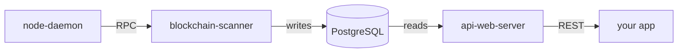

# API Overview

The Mintlayer indexer API is an HTTP REST API for querying blockchain data: blocks, transactions, addresses, balances, pools, delegations, tokens, NFTs, and orders. It is what block explorers, web wallets, and exchange backends use to read Mintlayer chain state without operating a full indexing pipeline themselves.

The node itself stores only the minimal data required to operate the chain (it does not index transactions by ID, balances, or history). The indexer fills that gap:



- The **blockchain scanner** (`api-blockchain-scanner-daemon`) follows the chain via the node's RPC and indexes everything into PostgreSQL.
- The **API web server** (`api-web-server`) answers REST queries from that database. It can also forward specialized requests (fee rate, transaction submission) to the node.

Both are separate binaries so the read layer can scale independently of the indexing layer. See the [command-line reference](/docs/category/command-line-reference) for their options, or run the whole stack with [Docker Compose](../getting-started/install/install-from-docker.md#running-the-api-server-stack).

## Base URLs

| Environment | Base URL |
| ----------- | -------- |
| Local | `http://127.0.0.1:3000/api/v2` |
| Production (Mintlayer-operated, mainnet) | `https://api-server.mintlayer.org/api/v2` |

All endpoint paths in this documentation are relative to the base URL. For example, the chain tip endpoint is `GET {base}/chain/tip`.

```bash
curl https://api-server.mintlayer.org/api/v2/chain/tip
```

## Versioning

All endpoints live under the `/api/v2` path prefix. Breaking changes will ship under a new version prefix; the root endpoint (`GET /`) reports the versions served:

```bash
curl https://api-server.mintlayer.org/
# {"versions":["v2"]}
```

## Conventions and guarantees

- **No authentication** for reads. The API is read-only by default and suitable for public frontends (CORS is open).
- **Writes are gated.** Submitting transactions via `POST /transaction` is disabled unless the server is started with `--enable-post-routes` (the production API does not expose it).
- **Pagination** on list endpoints via `offset` and `items` query parameters (default 10 items, max 100). See [Conventions](conventions.md).
- **Amounts** are returned as `{atoms, decimal}` pairs. See [Conventions](conventions.md).

## Documentation map

| Page | Contents |
| ---- | -------- |
| [Conventions](conventions.md) | Pagination, amounts, ID encodings, errors |
| [Chain](endpoints/chain.md) | Genesis, tip, block ID by height |
| [Blocks](endpoints/block.md) | Block, header, reward, transaction IDs |
| [Transactions](endpoints/transaction.md) | List, single, merkle path, single output |
| [Addresses](endpoints/address.md) | Balances, UTXOs, delegations, token authority |
| [Pools](endpoints/pool.md) | Staking pools, block stats, delegations |
| [Delegations](endpoints/delegation.md) | Delegation lookup |
| [Statistics](endpoints/statistics.md) | Coin and token supply statistics |
| [Tokens](endpoints/token.md) | Fungible tokens, ticker lookup |
| [NFTs](endpoints/nft.md) | NFT issuance data |
| [Orders](endpoints/order.md) | On-chain order book |
| [Fee rate](endpoints/feerate.md) | Mempool fee estimates |
| [Transaction submission](endpoints/transaction-submission.md) | POST /transaction (gated) |
