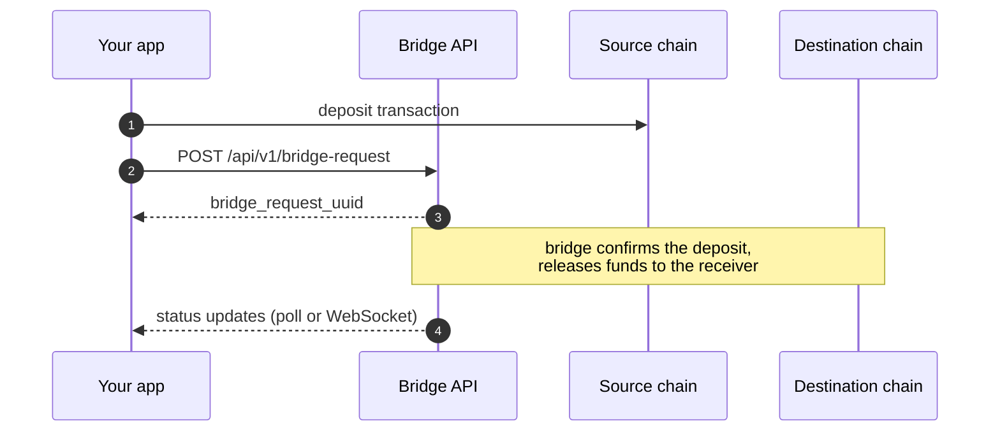

# Mintlayer-ERC20 bridge

The bridge transfers fungible tokens between Mintlayer and Ethereum (or any EVM-compatible chain). You submit a bridge request together with a deposit transaction; once the deposit is confirmed, the bridge releases the funds to the receiver address on the destination chain.



## API

Base path: `/api/v1`. The server root answers `GET /` with the served versions.

| Method | Path | Description |
| ------ | ---- | ----------- |
| POST | `/api/v1/bridge-request` | Submit a bridge request |
| GET | `/api/v1/bridge-request/{uuid}` | Fetch one bridge request by UUID |
| GET | `/api/v1/bridge-requests` | List bridge requests |
| GET | `/api/v1/deposit-transaction/{uuid}` | Fetch a deposit transaction record |
| GET | `/api/v1/withdrawal-transaction/{uuid}` | Fetch a withdrawal transaction record |
| GET | `/api/v1/fees` | Per-token bridge fees |
| GET | `/api/v1/subscribe` | WebSocket: live state-change events |

## Submitting a bridge request

```bash
curl -H 'Content-type: application/json' \
  --data '{
    "source_chain": "Mintlayer",
    "destination_chain": "Ethereum",
    "asset": "FOO",
    "amount": "100.00",
    "receiver_address": "0x6CFF507AeA2FE77a508E13DD4C2dF495780871D5",
    "deposit_transactions": [
      {
        "raw_transaction": "0100...5250",
        "intent": "0x6CFF507AeA2FE77a508E13DD4C2dF495780871D5"
      }
    ]
  }' \
  -X POST https://SERVER_URL/api/v1/bridge-request
```

Body fields:

| Field | Description |
| ----- | ----------- |
| `source_chain`, `destination_chain` | The chains to bridge between (e.g. `Mintlayer`, `Ethereum`) |
| `asset` | Token name, an arbitrary case-insensitive string unique within the bridge (usually the ticker) |
| `amount` | Total amount to transfer, as a decimal string; must equal the sum of the deposit transactions |
| `receiver_address` | Destination-chain address of the receiver |
| `deposit_transactions` | One or more deposits (normally exactly one) |

Each deposit transaction accepts either `raw_transaction` (complete hex-encoded transaction, **without** the `0x` prefix; the bridge submits it to the network) or `transaction_hash` (already submitted by other means; the bridge watches for it on-chain). m2e deposits additionally require `intent` (see below).

Response:

```json
{
  "bridge_request_uuid": "6f1e2b3a-...",
  "deposit_transaction_uuids": ["9c41d0f2-..."]
}
```

Rules:

- The sum of the deposit transactions must equal the request `amount`; deposits must reach the required number of network confirmations.
- If a deposit is not mined within the allowed window, the request is marked `failed`.
- For Mintlayer-to-Ethereum deposits, the deposit must be paired with a signed **intent**, and the intent string must be exactly the receiver address.

### Deposit intents (m2e)

In the Mintlayer-to-Ethereum direction the receiver address cannot be embedded in the transaction itself, so each deposit is paired with a signed intent. Two ways to produce it:

- `wallet-cli`: the `token-make-tx-to-send-with-intent` command creates the transaction and the intent together (mainly for testing).
- [WASM bindings](sdks/go/wasm.md): call `make_transaction_intent_message_to_sign`, sign the message with `sign_challenge` using the keys of all input destinations, then `encode_signed_transaction_intent`.

Intent signing only supports simple transactions: UTXO inputs, `Transfer` or `LockThenTransfer` outputs, and `PublicKey` / `PublicKeyHash` destinations.

## Tracking requests

Bridge request statuses: `pending`, `processed_by_master`, `completed`, `failed`, `manual`.

- `GET /api/v1/bridge-request/{uuid}` returns the request with its `status`, `amount_after_fees`, deposit transaction states, and the withdrawal transaction (when created).
- `GET /api/v1/bridge-requests` lists requests with `limit` (default 20, max 100), `status` (comma-separated filter, e.g. `pending,completed`), and `created_after` (RFC 3339 cursor for pagination).
- `GET /api/v1/subscribe` upgrades to WebSocket and pushes `BridgeRequestNewState`, `DepositTransactionNewState`, and `WithdrawalTransactionNewState` events as they happen.

## Fees

`GET /api/v1/fees` returns, per token, the fee applied to each bridge request:

```json
{
  "FOO": { "fixed_fee": "0.5", "percentage_fee": "0.1" }
}
```

The fixed part is applied first, then the percentage; the result is reflected in `amount_after_fees` on the bridge request.

## Related documentation

- [API overview](../api/index.md) for the indexer API your integration may pair with
- [Token endpoints](../api/endpoints/token.md) for querying bridged tokens
- [Issue and manage a token](../guides/issue-new-token.md) before bridging an MLS-01 token to Ethereum
