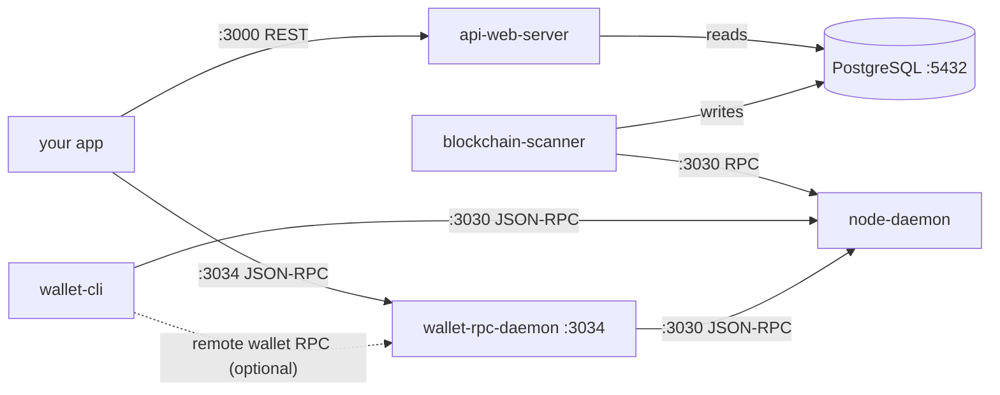

# Developer Setup

A quick-reference map of every Mintlayer service you will interact with as a developer: what it does, where it listens, how to authenticate, and how to talk to it.

## The stack at a glance



| Service | Default port | Protocol | Auth |
| ------- | ------------ | -------- | ---- |
| `node-daemon` RPC | **3030** mainnet, **13030** testnet | JSON-RPC 2.0 over HTTP **and** WebSocket (same port) | `.cookie` file or username/password |
| `wallet-rpc-daemon` RPC | **3034** mainnet, **13034** testnet | JSON-RPC 2.0 over HTTP and WebSocket | username/password |
| `api-web-server` (indexer REST) | **3000** | REST | none |
| PostgreSQL (indexer storage) | **5432** | n/a | database user/password |
| Node P2P (not an API) | 3031 mainnet, 13031 testnet | Mintlayer P2P | n/a |

## Running a node for development

The fastest route is Docker Compose, see [Install from Docker](../getting-started/install/install-from-docker.md) for ready-made compose files covering:

- node only (or node + `wallet-cli`)
- node + wallet-rpc-daemon + `wallet-cli` (staking in the background)
- node + PostgreSQL + blockchain scanner + API web server (full indexing stack)

For local testing without syncing a public network, run the node on **regtest**:

```bash
node-daemon regtest
```

Regtest enables developer-only RPC functions (see the [test functions reference](https://github.com/mintlayer/mintlayer-core/blob/master/node-daemon/docs/RPC_DEV.md)), such as generating blocks on demand and setting mock time via `node_set_mock_time`, useful for deterministic test environments. Related wallet-cli commands: `node-generate-block`, `node-generate-blocks`, `node-submit-block`.

## Connecting to the node RPC

One port serves both HTTP and WebSocket. JSON-RPC 2.0 over HTTP:

```bash
curl -H 'Content-Type: application/json' \
  --user $(cat ~/.mintlayer/mainnet/.cookie) \
  -d '{"jsonrpc": "2.0", "id": 1, "method": "chainstate_info", "params": []}' \
  http://127.0.0.1:3030
```

Authentication options, in order of convenience:

1. **Cookie file**, the node writes `~/.mintlayer/<network>/.cookie` (`username:password` on one line); any HTTP basic-auth client can use it as shown above. Best for local development.
2. **Username/password**, set explicitly with `ML_<NETWORK>_NODE_RPC_USERNAME` / `ML_<NETWORK>_NODE_RPC_PASSWORD` (e.g. `ML_MAINNET_NODE_RPC_USERNAME`). Required when connecting from another machine or container, e.g. `ML_MAINNET_NODE_RPC_BIND_ADDRESS: 0.0.0.0:3030` plus credentials in a compose file.

Over WebSocket, method calls work the same way, plus you can **subscribe to events** and receive notifications on the open connection, e.g. new mainchain tips via `chainstate_subscribe_to_events` or new mempool transactions via `mempool_subscribe_to_events`:

```
{"jsonrpc": "2.0", "method": "chainstate_subscribe_to_events", "params": [], "id": 1}
```

The full method list (~60 methods across the `node`, `chainstate`, `mempool`, `p2p`, and `blockprod` modules) is in the [node RPC reference](https://github.com/mintlayer/mintlayer-core/blob/master/node-daemon/docs/RPC.md), with per-command guides under [Node Commands](../getting-started/index.md).

## Connecting to the wallet RPC

Start the daemon with an open wallet file and explicit credentials:

```bash
wallet-rpc-daemon mainnet \
  --wallet-file /home/mintlayer/my_wallet \
  --rpc-bind-address 0.0.0.0:3034 \
  --rpc-username developer --rpc-password <secret>
```

Then call it like any JSON-RPC 2.0 endpoint:

```bash
curl -H 'Content-Type: application/json' \
  -H 'Authorization: Basic...' \
  -d '{"jsonrpc": "2.0", "id": 1, "method": "account_balance", "params": {"account": 0, "utxo_states": ["Confirmed"]}}' \
  http://developer:<secret>@127.0.0.1:3034
```

WebSocket on the same port adds wallet event subscriptions:

```
{"jsonrpc": "2.0", "method": "subscribe_wallet_events", "params": [{}], "id": 1}
```

The wallet exposes ~114 documented methods, wallet management, addresses, transactions, staking, tokens, orders, and HTLCs. Browse them in the [Wallet RPC overview](../wallet/rpc/overview.md) and its per-module pages, or in the raw [method reference](https://github.com/mintlayer/mintlayer-core/blob/master/wallet/wallet-rpc-daemon/docs/RPC.md).

## Querying the indexer (REST)

The API web server answers REST queries from the PostgreSQL database populated by the blockchain scanner:

```bash
curl http://127.0.0.1:3000/api/v2/chain/tip
```

It covers blocks, transactions, tokens, addresses, pool and order data, see the [API server](../getting-started/index.md) documentation for the endpoint catalog and the [Docker Compose stack](../getting-started/install/install-from-docker.md#running-the-api-server-stack) to run it locally.

## WASM wrappers

For browser and Node.js applications, Mintlayer publishes core crypto and serialization logic compiled to WebAssembly (the `wasm-wrappers` crate in mintlayer-core, the same code the Mojito wallet uses). It exposes functions such as:

- `make_default_account_privkey`, BIP39 mnemonic → account key, derivation path `44'/mintlayer_coin_type'/0'` (with optional passphrase)
- `make_receiving_address` / `make_change_address`, per-index key derivation
- `pubkey_to_pubkeyhash_address`, address encoding per network
- `sign_message_for_spending`, transaction/message signing
- `encode_outpoint_source_id`, UTXO serialization helpers

Build it yourself with [wasm-pack](https://rustwasm.github.io/wasm-pack/):

```bash
wasm-pack build --target web      # for browsers
wasm-pack build --target nodejs   # for Node.js
```

The complete function catalog is in the [WASM API reference](https://github.com/mintlayer/mintlayer-core/blob/master/wasm-wrappers/WASM-API.md). For wallet integration at a higher level, see [Building on Mintlayer](index.md).

## AI agents

- [MCP](mcp.md): hosted MCP endpoint for MCP-compatible AI assistants.
- This documentation site exposes [llms.txt](https://docs.mintlayer.org/llms.txt) and per-page markdown for machine consumption.
