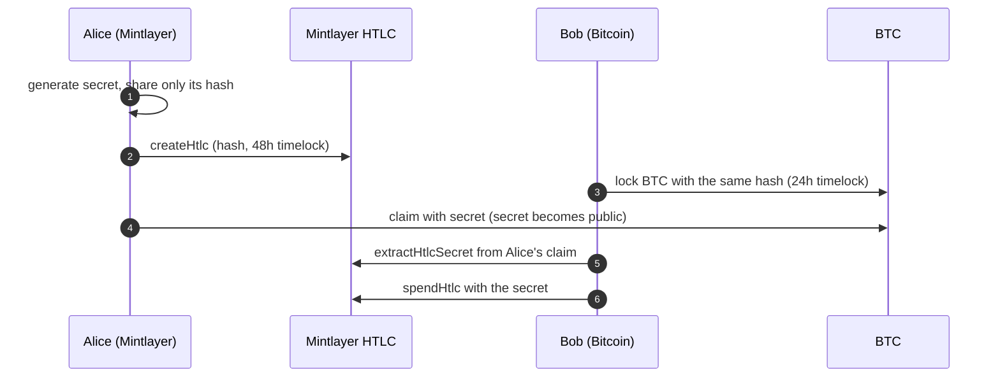

# Atomic Swap (SDK)

The SDK equivalent of [Atomic Swap with Bitcoin (HTLC)](../../wallet/guides/atomic-swap-with-bitcoin.md). Read that guide for the full protocol — roles, the secret/hash flow, and [timelock planning](../../wallet/guides/atomic-swap-with-bitcoin.md#timelock-planning) (the Bitcoin timelock must be shorter than the Mintlayer one). This page shows how to build the **Mintlayer side** in code.



If a party stalls, the HTLC's refund path returns the funds once the timelock expires.

## Mintlayer side with the JavaScript SDK

The `Client` covers the whole HTLC lifecycle: [`createHtlc`](../sdks/javascript/transactions.md#htlcs-hash-time-locked-contracts), `spendHtlc`, `refundHtlc`, and `extractHtlcSecret`.

### 1. Alice locks ML with the secret hash

```ts
// Secret generated off-band (e.g. crypto.randomBytes(32)); only the hash is shared
const secretHash = {
  hex: 'a3f1c2...',     // hash of the secret
  string: null,
};

const signedTx = await client.createHtlc({
  amount: 100,
  // token_id: 'tmltk1...',          // optional: swap a token instead of ML
  secret_hash: secretHash,
  spend_address: bobMlAddress,       // where a successful claim pays out
  spend_pubkey: bobPubkeyHex,
  refund_address: aliceAddress,      // where a refund returns
  refund_timelock: 172800,           // e.g. 48h, agreed off-chain
});

await client.broadcastTx(signedTx);
```

### 2. Alice claims Bob's BTC (on Bitcoin)

Alice spends Bob's Bitcoin HTLC by revealing the secret — this happens on the Bitcoin side with your Bitcoin tooling and is unchanged by the SDK.

### 3. Bob extracts the secret and claims the ML

```ts
// Read the secret from Alice's claim transaction on Bitcoin
const secret = await client.extractHtlcSecret({
  transaction_id: txid,
  transaction_hex: rawTxHex,
});

// Or ask the connected wallet for a secret hash when you are the one generating it:
const hash = await client.requestSecretHash({});

// Claim the Mintlayer HTLC
const claimTx = await client.spendHtlc({ transaction_id: mlHtlcTxId, secret });
await client.broadcastTx(claimTx);
```

### 4. Refund path

If the swap never completes, the original locker reclaims after the timelock:

```ts
const refundTx = await client.refundHtlc({ transaction_id: mlHtlcTxId });
await client.broadcastTx(refundTx);
```

## Mintlayer side with the Go SDK

The Go `wasm` package exposes the same primitives for manual transaction building:

```go
import mintlayer "github.com/mintlayer/go-sdk/wasm"

c, _ := mintlayer.New(ctx)

// Lock funds in an HTLC
htlcOutput, err := c.EncodeOutputHTLC(
    mintlayer.NewAmount("100000000000"),
    nil,                       // token ID: nil for the base coin
    secretHash,
    spendAddress,
    refundAddress,
    refundTimelock,            // encoded timelock
    mintlayer.Mainnet,
)

// Spend (claim) the HTLC, embedding the preimage
witness, err := c.EncodeWitnessHTLCSpend(/* input, secret, ... */)

// Refund after the timelock with a single-signature refund address
witness, err = c.EncodeWitnessHTLCRefundSingleSig(/* input, ... */)

// Learn the counterparty's secret from their claim transaction
secret, err := c.ExtractHTLCSecret(signedTx, true, htlcOutpointSourceId, htlcOutputIndex)
```

See [Go SDK: WASM](../sdks/go/wasm.md) for the exact signatures and the signing/assembly flow.

## Checklist

- Agree off-chain on amounts, rate, and **timelock durations** before locking anything.
- Bitcoin timelock strictly shorter than the Mintlayer timelock.
- Only the hash is shared; the secret is revealed by the first claim.
- Verify the on-chain HTLC (amount, addresses, timelock) before locking the other side.
