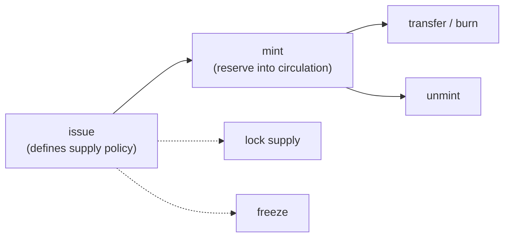

# Issue a Token (SDK)

This guide is the SDK equivalent of [Issuing and managing a token](../../wallet/guides/issue-new-token.md) — read that page for the underlying concepts (token id, authority address, reserve vs circulating supply). Here we do the same lifecycle in code:



Prerequisites: a funded wallet with a small ML balance for fees, and (Go) a running `wallet-rpc-daemon` plus indexer.

## Issuing

**JavaScript**

```ts
import { Client } from '@mintlayer/sdk';

const client = await Client.create({ network: 'testnet' });
await client.connect();

const signedTx = await client.issueToken({
  token_ticker: 'MYTOKEN',
  number_of_decimals: 8,
  metadata_uri: 'https://example.com/mytoken.json',
  is_freezable: true,
  supply_type: 'Lockable', // 'Unlimited' | 'Lockable' | 'Fixed'
  // supply_amount: 1000000,   // required for 'Fixed'
  authority: client.getAddresses().receiving[0],
});
```

**Go**

```go
import "github.com/mintlayer/go-sdk/wallet"

wc := wallet.New("http://127.0.0.1:3034")

authorityAddr, err := wc.NewAddress(ctx, 0)

result, err := wc.IssueToken(ctx, wallet.IssueTokenParams{
    Account:            0,
    DestinationAddress: authorityAddr,
    Metadata: wallet.TokenMetadata{
        TokenTicker:      "MYTOKEN",
        NumberOfDecimals: 8,
        MetadataURI:      "https://example.com/mytoken.json",
        TokenSupply:      wallet.TokenSupply{Type: "Lockable"},
        IsFreezable:      true,
    },
})
fmt.Printf("token id: %s  tx: %s\n", result.TokenID, result.TxID)
```

For a fixed supply, cap it at issuance: `TokenSupply{Type: "Fixed", Content: &wallet.Amount{Atoms: "1000000"}}` (Go) or `supply_type: 'Fixed'` + `supply_amount` (JS).

The token id is assigned when the issuance transaction confirms; in Go it is returned directly, in JS it can be predicted or read from the indexer.

## Metadata

Publish metadata at `metadata_uri` following the [Token Metadata Standards](../../reference/token-standards/index.md) (MLS-01 schema) so wallets and explorers can render your token. The URI can be updated later by the authority.

## Minting and unminting

Wait for the issuance transaction to confirm first. Minting moves tokens from the reserve into circulation; unminting reverses it.

**JavaScript**

```ts
await client.mintToken({ token_id: 'tmltk1...', amount: 1000, destination: 'tmt1q...' });
await client.unmintToken({ token_id: 'tmltk1...', amount: 500 });
```

**Go**

```go
mintResult, err := wc.MintTokens(ctx, wallet.MintParams{
    Account: 0, TokenID: result.TokenID,
    Address: recipientAddr,
    Amount:  wallet.Amount{Atoms: "100000"}, // smallest units
})

_, err = wc.UnmintTokens(ctx, wallet.UnmintParams{
    Account: 0, TokenID: result.TokenID,
    Amount: wallet.Amount{Atoms: "50000"},
})
```

## Transferring and burning

**JavaScript**

```ts
await client.transfer({ to: 'tmt1q...', amount: 10, token_id: 'tmltk1...' });
await client.burn({ token_id: 'tmltk1...', amount: 25 });
```

**Go**

```go
_, err = wc.SendToken(ctx, wallet.TokenSendParams{
    Account: 0, TokenID: result.TokenID,
    Address: recipientAddr,
    Amount:  wallet.Amount{Atoms: "10000"},
})
```

## Authority, freeze, and supply lock

All management operations require the **token authority** key:

**JavaScript**

```ts
await client.lockTokenSupply({ token_id: 'tmltk1...' });                 // irreversible
await client.freezeToken({ token_id: 'tmltk1...', is_unfreezable: false });
await client.unfreezeToken({ token_id: 'tmltk1...' });
await client.changeTokenAuthority({ token_id: 'tmltk1...', new_authority: 'tmt1q...' });
await client.changeMetadataUri({ token_id: 'tmltk1...', new_metadata_uri: 'https://...' });
```

**Go**

```go
_, err = wc.LockTokenSupply(ctx, wallet.LockSupplyParams{AccountIndex: 0, TokenID: result.TokenID})

_, err = wc.FreezeToken(ctx, wallet.FreezeParams{Account: 0, TokenID: result.TokenID, IsUnfreezable: true})
_, err = wc.UnfreezeToken(ctx, wallet.UnfreezeParams{Account: 0, TokenID: result.TokenID})
_, err = wc.ChangeTokenAuthority(ctx, wallet.ChangeAuthorityParams{Account: 0, TokenID: result.TokenID, Address: newAuthorityAddr})
```

## Reading token state

**JavaScript**: `client.getTokensOwned()` and `client.getBalances()` cover the connected addresses.

**Go** (indexer):

```go
import "github.com/mintlayer/go-sdk/indexer"

idx := indexer.New("http://127.0.0.1:3000")

token, err := idx.GetToken(ctx, result.TokenID)
fmt.Printf("ticker: %s  circulating: %s  locked: %v  frozen: %v\n",
    token.TokenTicker, token.CirculatingSupply.Decimal, token.IsLocked, token.Frozen)
```

See the [Go SDK: Tokens](../sdks/go/tokens.md) reference for protocol fees (`FungibleTokenIssuanceFee`, `TokenSupplyChangeFee`, …) and manual transaction building with the `wasm` package.
