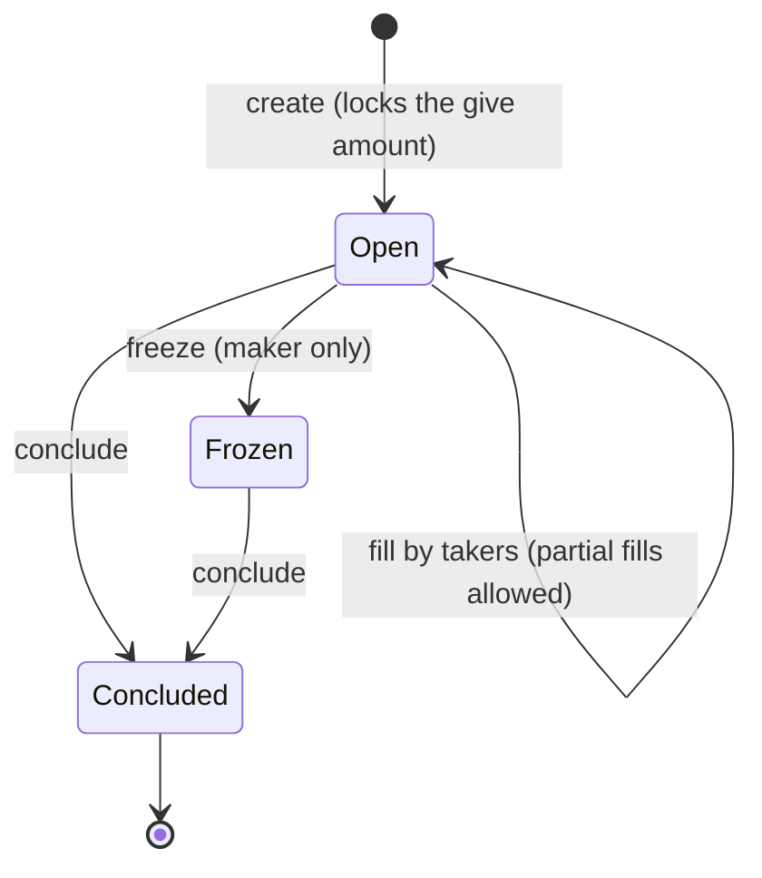

# Trading with Orders (SDK)

The SDK equivalent of [Trading with orders](../../wallet/guides/trading-with-orders.md). An order locks a `give` amount on-chain and asks for an `ask` amount in return. Anyone may fill it (fully or partially); the maker can freeze it and conclude it to reclaim the remainder:



## Creating an order

**JavaScript**

```ts
const signedTx = await client.createOrder({
  give_token: 'tmltk1...',          // what you lock ('0' for the base coin)
  give_amount: 100,
  ask_token: 'tmltk2...',           // what you ask for in return
  ask_amount: 10,
  conclude_destination: 'tmt1q...', // where concluded leftovers return
});
```

**Go** (wasm encoders — the wallet sub-client has no high-level order methods):

```go
import mintlayer "github.com/mintlayer/go-sdk/wasm"

c, _ := mintlayer.New(ctx)

// Outputs: the ask request plus the give amount locked by the order
createOrderOutput, err := c.EncodeCreateOrderOutput(
    mintlayer.NewAmount("100"), // give amount
    askToken, askAmount,
    concludeAddress,
    mintlayer.Mainnet,
)

// The order id is derived from the built inputs
orderID, err := c.GetOrderId(encodedInputs, mintlayer.Mainnet)
```

Assemble and submit the transaction with the [wasm transaction flow](../sdks/go/transactions.md).

## Discovering orders

**JavaScript**

```ts
const open = await client.getAvailableOrders(); // fillable on the network
const mine = await client.getAccountOrders();   // created by this account
```

**Go** (indexer):

```go
import "github.com/mintlayer/go-sdk/indexer"

idx := indexer.New("http://127.0.0.1:3000")

orders, err := idx.ListOrders(ctx, indexer.PageOpts{Items: 50})
pair, err := idx.ListOrdersByPair(ctx, "Coin", "tmltk1...", indexer.PageOpts{Items: 50})

order, err := idx.GetOrder(ctx, orderID)
fmt.Printf("ask: %v  give: %v\n", order.AskBalance, order.GiveBalance)
```

The node RPC also exposes `OrderInfo` and `OrdersInfoByCurrencies` — see [Go SDK: Node](../sdks/go/node.md#token-and-order-info).

## Filling an order

**JavaScript**

```ts
const signedTx = await client.fillOrder({
  order_id: 'ord1...',
  amount: 5, // how much of the ask you fulfill
  destination: 'tmt1q...', // where you receive your side
});
```

**Go**: encode the fill input against the order's current nonce, then sign and submit:

```go
fillInput, err := c.EncodeInputForFillOrder(
    orderID,
    mintlayer.NewAmount("5"),
    destinationAddress,
    nonce, currentBlockHeight,
    mintlayer.Mainnet,
)
```

## Concluding and freezing (maker)

**JavaScript**

```ts
await client.concludeOrder('ord1...');
```

**Go**

```go
concludeInput, err := c.EncodeInputForConcludeOrder(orderID, nonce, currentBlockHeight, mintlayer.Mainnet)
freezeInput, err := c.EncodeInputForFreezeOrder(orderID, currentBlockHeight, mintlayer.Mainnet)
```

Concluding returns the unclaimed `give` remainder plus any accumulated `ask` balance to the order's conclude destination. Only the maker can freeze or conclude.

## Example: market-maker loop

```ts
import { Client } from '@mintlayer/sdk';

const client = await Client.create({ network: 'testnet', autoRestore: true });
await client.connect();

// Quote both sides of a market and quote an order against your inventory
for (const order of await client.getAvailableOrders()) {
  // compare order.ask_balance / order.give_balance against your target price...
}

await client.createOrder({
  give_token: 'tmltk1...',
  give_amount: 100,
  ask_token: '0',
  ask_amount: 10,
  conclude_destination: client.getAddresses().receiving[0],
});
```
