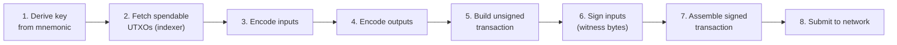

# Building Transactions

The wallet daemon handles transaction building automatically for most use cases. Use the `wasm` package directly when you need:

- Full custody (no wallet daemon)
- Custom output types or complex spending conditions
- Integration testing or tooling

The [examples/send-coins/](https://github.com/mintlayer/go-sdk/tree/master/examples/send-coins/main.go) program demonstrates this flow end to end.

---

## Overview

Building a transaction manually requires these steps:



The equivalent numbered steps in detail:

1. Derive the spending key and address from a mnemonic
2. Fetch spendable UTXOs from the indexer
3. Encode each input as binary
4. Encode each output as binary
5. Build the unsigned transaction
6. Sign each input to produce witness bytes
7. Assemble the signed transaction
8. Submit to the network

---

## Step 1: Key derivation

```go
import mintlayer "github.com/mintlayer/go-sdk/wasm"

ctx := context.Background()
c, err := mintlayer.New(ctx)
if err != nil {
    log.Fatal(err)
}
defer c.Close()

mnemonic := "word1 word2 ... word12"

accountKey, err := c.MakeDefaultAccountPrivkey(mnemonic, mintlayer.Mainnet)
if err != nil {
    log.Fatal(err)
}

// key index 0 = first receiving address
spendKey, err := c.MakeReceivingAddress(accountKey, 0)
pubKey, err   := c.PublicKeyFromPrivateKey(spendKey)
fromAddr, err := c.PubkeyToPubkeyHashAddress(pubKey, mintlayer.Mainnet)
```

---

## Step 2: Fetch spendable UTXOs

```go
import "github.com/mintlayer/go-sdk/indexer"

idxClient := indexer.New("http://127.0.0.1:3000")

utxos, err := idxClient.GetSpendableUTXOs(ctx, fromAddr)
if err != nil {
    log.Fatal(err)
}
if len(utxos) == 0 {
    log.Fatal("no spendable UTXOs")
}
```

---

## Step 3: Encode inputs

Each input requires:

1. Hex-decode the source transaction ID
2. Encode the outpoint source ID (`EncodeOutpointSourceId`)
3. Encode the input (`EncodeInputForUtxo`)

```go
import "encoding/hex"

var encodedInputs []byte

for _, u := range utxos {
    txIDBytes, err := hex.DecodeString(u.Outpoint.SourceID)
    if err != nil {
        log.Fatal(err)
    }

    srcID, err := c.EncodeOutpointSourceId(txIDBytes, mintlayer.SourceTransaction)
    if err != nil {
        log.Fatal(err)
    }

    inp, err := c.EncodeInputForUtxo(srcID, u.Outpoint.Index)
    if err != nil {
        log.Fatal(err)
    }

    encodedInputs = append(encodedInputs, inp...)
}
```

---

## Step 4: Encode outputs

```go
output, err := c.EncodeOutputTransfer(
    mintlayer.NewAmount("100000000000"), // 1 ML in atoms
    "mxtc1qrecipient...",
    mintlayer.Mainnet,
)
if err != nil {
    log.Fatal(err)
}
```

For multiple outputs, concatenate them:

```go
changeOutput, err := c.EncodeOutputTransfer(
    mintlayer.NewAmount(changeAtoms.String()),
    fromAddr, // send change back to sender
    mintlayer.Mainnet,
)

allOutputs := append(output, changeOutput...)
```

---

## Step 5: Build the unsigned transaction

```go
tx, err := c.EncodeTransaction(encodedInputs, output, 0 /*flags*/)
if err != nil {
    log.Fatal(err)
}

txID, err := c.GetTransactionID(tx, true)
log.Printf("unsigned tx id: %s", txID)
```

---

## Step 6: Prepare UTXO bytes for signing

The sighash computation requires access to the UTXO being spent. Build a per-input slice where each entry is either:

- `0x01` followed by the re-encoded output bytes (recommended for coin transfers)
- `0x00` alone (acceptable for some output types)

```go
var allUtxoBytes []byte

for _, u := range utxos {
    var raw struct {
        Type  string `json:"type"`
        Value struct {
            Type   string `json:"type"`
            Amount struct {
                Atoms string `json:"atoms"`
            } `json:"amount"`
        } `json:"value"`
        Destination string `json:"destination"`
    }

    if err := json.Unmarshal(u.Output, &raw); err != nil {
        allUtxoBytes = append(allUtxoBytes, 0x00)
        continue
    }

    if raw.Type == "Transfer" && raw.Value.Type == "Coin" {
        encoded, err := c.EncodeOutputTransfer(
            mintlayer.NewAmount(raw.Value.Amount.Atoms),
            raw.Destination,
            mintlayer.Mainnet,
        )
        if err == nil {
            allUtxoBytes = append(allUtxoBytes, 0x01)
            allUtxoBytes = append(allUtxoBytes, encoded...)
            continue
        }
    }

    allUtxoBytes = append(allUtxoBytes, 0x00)
}
```

---

## Step 7: Sign each input

Call `EncodeWitness` once per input. Concatenate results.

```go
var witnessBytes []byte

for i := range utxos {
    w, err := c.EncodeWitness(
        mintlayer.SigHashAll,
        spendKey,
        fromAddr,
        tx,
        allUtxoBytes,
        uint32(i),
        mintlayer.TxAdditionalInfo{}, // empty for standard transfers
        0, // block height (0 when no timelock constraint)
        mintlayer.Mainnet,
    )
    if err != nil {
        log.Fatalf("sign input %d: %v", i, err)
    }
    witnessBytes = append(witnessBytes, w...)
}
```

---

## Step 8: Assemble and submit

```go
signedTx, err := c.EncodeSignedTransaction(tx, witnessBytes)
if err != nil {
    log.Fatal(err)
}

signedHex := hex.EncodeToString(signedTx)

// Submit via the indexer (requires --enable-post-routes)
submittedTxID, err := idxClient.SubmitTransaction(ctx, signedHex)
if err != nil {
    log.Fatal(err)
}
fmt.Printf("submitted: %s\n", submittedTxID)

// Alternative: broadcast via the node daemon
// err = nodeClient.P2PSubmitTransaction(ctx, signedHex, node.TrustPolicyUntrusted)
```

---

## Fee estimation

Compute the fee before constructing outputs so you can deduct it from the change:

```go
// Collect destination addresses (one per input, in input order)
destAddresses := make([]string, len(utxos))
for i := range utxos {
    destAddresses[i] = fromAddr
}

estimatedSize, err := c.EstimateTransactionSize(encodedInputs, destAddresses, allOutputs, mintlayer.Mainnet)
if err != nil {
    log.Fatal(err)
}

// GetFeeRate returns atoms per KB for the top 1 MB of the mempool
feeRateStr, err := idxClient.GetFeeRate(ctx, 1)
if err != nil {
    log.Fatal(err)
}

feeRate, _ := new(big.Int).SetString(feeRateStr, 10)
sizeKB := new(big.Int).SetUint64(uint64(estimatedSize))
fee := new(big.Int).Mul(sizeKB, feeRate)
fee.Div(fee, big.NewInt(1000))

// Subtract fee from the amount going to the recipient or from the change output.
```

---

## Lock-then-transfer outputs

To send coins that cannot be spent for a period of time:

```go
// Unlock after 1000 blocks
lock, err := c.EncodeLockForBlockCount(1000)

output, err := c.EncodeOutputLockThenTransfer(
    mintlayer.NewAmount("100000000000"),
    "mxtc1qrecipient...",
    lock,
    mintlayer.Mainnet,
)
```

---

## Token transfers

Sending fungible tokens uses the same flow, with a different output encoder:

```go
tokenOutput, err := c.EncodeOutputTokenTransfer(
    mintlayer.NewAmount("1000"), // token amount in smallest units
    "mxtc1qrecipient...",
    "ttml1tokenid...",
    mintlayer.Mainnet,
)
```

Note that a token transfer transaction must also include a coin output (or coin inputs) to cover the network fee.
