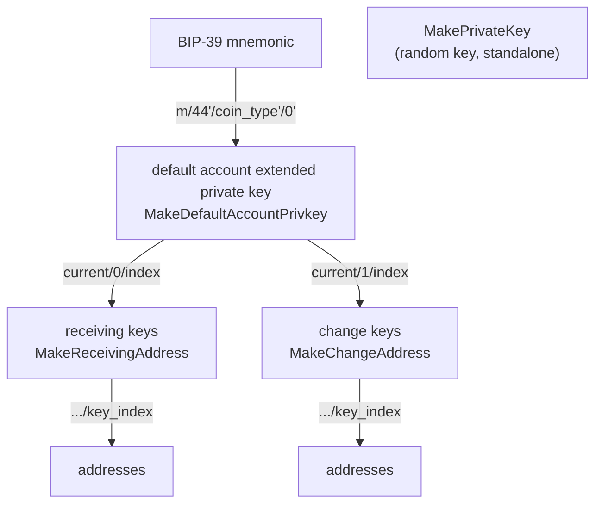

# WASM Client

The `wasm` package (import path `github.com/mintlayer/go-sdk/wasm`, package name `mintlayer`) exposes cryptographic primitives and binary transaction encoding via an embedded WebAssembly module.

```go
import (
    "context"
    mintlayer "github.com/mintlayer/go-sdk/wasm"
)

ctx := context.Background()
c, err := mintlayer.New(ctx)
if err != nil {
    log.Fatal(err)
}
defer c.Close()
```

Initialization compiles the embedded WASM binary, which takes roughly 400 ms. Call it once per process using `sync.Once` or the top-level `sdk.Client.InitWASM`.

The `Client` is safe for concurrent use by multiple goroutines.

---

## Amounts

```go
type Amount struct { /* private atoms field */ }

func NewAmount(atoms string) Amount
func NewAmountZero() Amount

func (a Amount) Atoms() string
func (a Amount) String() string
```

All amounts are decimal strings of atoms. **1 ML = 100,000,000,000 atoms** (11 decimal places).

```go
one := mintlayer.NewAmount("100000000000")  // 1 ML
fmt.Println(one.Atoms()) // "100000000000"
```

---

## Networks

```go
type Network int

const (
    Mainnet Network = 0
    Testnet Network = 1
    Regtest Network = 2
    Signet  Network = 3
)
```

Pass the appropriate constant to any function that generates addresses or encodes transactions.

---

## Key derivation

The derivation hierarchy implemented by these functions:



### `MakePrivateKey`

```go
func (c *Client) MakePrivateKey() ([]byte, error)
```

Generates a random private key.

### `MakeDefaultAccountPrivkey`

```go
func (c *Client) MakeDefaultAccountPrivkey(mnemonic string, network Network) ([]byte, error)
```

Derives the default account extended private key from a BIP-39 mnemonic. The derivation path is `m/44'/coin_type'/0'` where `coin_type` depends on the network.

### `PublicKeyFromPrivateKey`

```go
func (c *Client) PublicKeyFromPrivateKey(privkey []byte) ([]byte, error)
```

Derives the compressed public key from a private key.

### `ExtendedPublicKeyFromExtendedPrivateKey`

```go
func (c *Client) ExtendedPublicKeyFromExtendedPrivateKey(privkey []byte) ([]byte, error)
```

Derives the extended public key from an extended private key. Useful for watch-only wallets.

### `MakeReceivingAddress`

```go
func (c *Client) MakeReceivingAddress(accountPrivkey []byte, keyIndex uint32) ([]byte, error)
```

Derives the private key for receiving address `keyIndex` within an account.

### `MakeChangeAddress`

```go
func (c *Client) MakeChangeAddress(accountPrivkey []byte, keyIndex uint32) ([]byte, error)
```

Derives the private key for change address `keyIndex` within an account.

### `MakeReceivingAddressPublicKey`

```go
func (c *Client) MakeReceivingAddressPublicKey(accountPubkey []byte, keyIndex uint32) ([]byte, error)
```

Derives the public key for receiving address `keyIndex` from an extended public key. Does not require the private key.

### `MakeChangeAddressPublicKey`

```go
func (c *Client) MakeChangeAddressPublicKey(accountPubkey []byte, keyIndex uint32) ([]byte, error)
```

Derives the public key for change address `keyIndex` from an extended public key.

**Example: derive a receiving address from a mnemonic**

```go
mnemonic := "abandon abandon abandon ... about"

accountKey, err := c.MakeDefaultAccountPrivkey(mnemonic, mintlayer.Mainnet)
recvKey, err   := c.MakeReceivingAddress(accountKey, 0)
pubKey, err    := c.PublicKeyFromPrivateKey(recvKey)
addr, err      := c.PubkeyToPubkeyHashAddress(pubKey, mintlayer.Mainnet)
```

---

## Addresses

### `EncodeDestination`

```go
func (c *Client) EncodeDestination(address string, network Network) ([]byte, error)
```

Encodes a bech32m address into its binary representation for use in transaction outputs.

### `PubkeyToPubkeyHashAddress`

```go
func (c *Client) PubkeyToPubkeyHashAddress(pubkey []byte, network Network) (string, error)
```

Derives a P2PKH bech32m address from a compressed public key.

### `EncodeMultisigChallenge`

```go
func (c *Client) EncodeMultisigChallenge(pubkeys []byte, minRequiredSignatures uint32, network Network) ([]byte, error)
```

Encodes a multisig challenge (script) from a concatenation of compressed public keys.

### `MultisigChallengeToAddress`

```go
func (c *Client) MultisigChallengeToAddress(challenge []byte, network Network) (string, error)
```

Derives a bech32m address from a multisig challenge.

---

## IDs

These functions derive chain-assigned IDs from transaction inputs. The ID is deterministic: the same inputs always produce the same ID.

### `GetPoolId`

```go
func (c *Client) GetPoolId(inputs []byte, network Network) (string, error)
```

Derives the pool ID that will be assigned to a `CreateStakePool` transaction.

### `GetTokenId`

```go
func (c *Client) GetTokenId(inputs []byte, currentBlockHeight uint64, network Network) (string, error)
```

Derives the token ID that will be assigned to an `IssueFungibleToken` transaction.

### `GetDelegationId`

```go
func (c *Client) GetDelegationId(inputs []byte, network Network) (string, error)
```

Derives the delegation ID that will be assigned to a `CreateDelegationId` transaction.

### `GetOrderId`

```go
func (c *Client) GetOrderId(inputs []byte, network Network) (string, error)
```

Derives the order ID that will be assigned to a `CreateOrder` transaction.

---

## Inputs

Each input is a binary blob. Concatenate all input blobs to form the `inputs` slice passed to `EncodeTransaction`.

### `EncodeInputForUtxo`

```go
func (c *Client) EncodeInputForUtxo(outpointSourceID []byte, outputIndex uint32) ([]byte, error)
```

Encodes a UTXO spending input. `outpointSourceID` is the result of `EncodeOutpointSourceId`.

### `EncodeInputForWithdrawFromDelegation`

```go
func (c *Client) EncodeInputForWithdrawFromDelegation(delegationID string, amount Amount, nonce uint64, network Network) ([]byte, error)
```

Encodes a delegation withdrawal input. `nonce` must match the current `NextNonce` from the indexer's delegation record.

### `EncodeInputForMintTokens`

```go
func (c *Client) EncodeInputForMintTokens(tokenID string, amount Amount, nonce uint64, network Network) ([]byte, error)
```

### `EncodeInputForUnmintTokens`

```go
func (c *Client) EncodeInputForUnmintTokens(tokenID string, nonce uint64, network Network) ([]byte, error)
```

### `EncodeInputForLockTokenSupply`

```go
func (c *Client) EncodeInputForLockTokenSupply(tokenID string, nonce uint64, network Network) ([]byte, error)
```

### `EncodeInputForFreezeToken`

```go
func (c *Client) EncodeInputForFreezeToken(tokenID string, isTokenUnfreezable TokenUnfreezable, nonce uint64, network Network) ([]byte, error)
```

### `EncodeInputForUnfreezeToken`

```go
func (c *Client) EncodeInputForUnfreezeToken(tokenID string, nonce uint64, network Network) ([]byte, error)
```

### `EncodeInputForChangeTokenAuthority`

```go
func (c *Client) EncodeInputForChangeTokenAuthority(tokenID, newAuthority string, nonce uint64, network Network) ([]byte, error)
```

### `EncodeInputForChangeTokenMetadataURI`

```go
func (c *Client) EncodeInputForChangeTokenMetadataURI(tokenID, newMetadataURI string, nonce uint64, network Network) ([]byte, error)
```

### `EncodeInputForConcludeOrder`

```go
func (c *Client) EncodeInputForConcludeOrder(orderID string, nonce, currentBlockHeight uint64, network Network) ([]byte, error)
```

### `EncodeInputForFillOrder`

```go
func (c *Client) EncodeInputForFillOrder(orderID string, fillAmount Amount, destination string, nonce, currentBlockHeight uint64, network Network) ([]byte, error)
```

### `EncodeInputForFreezeOrder`

```go
func (c *Client) EncodeInputForFreezeOrder(orderID string, currentBlockHeight uint64, network Network) ([]byte, error)
```

---

## Outputs

Each output is a binary blob. Concatenate all output blobs to form the `outputs` slice passed to `EncodeTransaction`.

### `EncodeOutputTransfer`

```go
func (c *Client) EncodeOutputTransfer(amount Amount, address string, network Network) ([]byte, error)
```

Coin transfer to an address. This is the standard output type for sending ML.

### `EncodeOutputTokenTransfer`

```go
func (c *Client) EncodeOutputTokenTransfer(amount Amount, address, tokenID string, network Network) ([]byte, error)
```

Fungible token transfer to an address.

### `EncodeOutputLockThenTransfer`

```go
func (c *Client) EncodeOutputLockThenTransfer(amount Amount, address string, lock []byte, network Network) ([]byte, error)
```

Coin transfer with a timelock. The coins are sent to `address` but cannot be spent until the lock expires. `lock` is the result of one of the `EncodeLock*` functions.

### `EncodeOutputTokenLockThenTransfer`

```go
func (c *Client) EncodeOutputTokenLockThenTransfer(amount Amount, address, tokenID string, lock []byte, network Network) ([]byte, error)
```

Token transfer with a timelock.

### `EncodeOutputCoinBurn`

```go
func (c *Client) EncodeOutputCoinBurn(amount Amount) ([]byte, error)
```

Permanently destroys ML coins.

### `EncodeOutputTokenBurn`

```go
func (c *Client) EncodeOutputTokenBurn(amount Amount, tokenID string, network Network) ([]byte, error)
```

Permanently destroys fungible tokens.

### `EncodeOutputCreateDelegation`

```go
func (c *Client) EncodeOutputCreateDelegation(poolID, ownerAddress string, network Network) ([]byte, error)
```

Creates a delegation for `ownerAddress` in `poolID`. Use `GetDelegationId` to predict the delegation ID before broadcasting.

### `EncodeOutputDelegateStaking`

```go
func (c *Client) EncodeOutputDelegateStaking(amount Amount, delegationID string, network Network) ([]byte, error)
```

Sends coins into an existing delegation.

### `EncodeOutputCreateStakePool`

```go
func (c *Client) EncodeOutputCreateStakePool(poolID string, poolData []byte, network Network) ([]byte, error)
```

Creates a staking pool. `poolData` is the result of `EncodeStakePoolData`.

### `EncodeOutputProduceBlockFromStake`

```go
func (c *Client) EncodeOutputProduceBlockFromStake(poolID, staker string, network Network) ([]byte, error)
```

Reward output used in blocks produced by a pool. Only relevant for block producers.

### `EncodeOutputDataDeposit`

```go
func (c *Client) EncodeOutputDataDeposit(data []byte) ([]byte, error)
```

Embeds arbitrary bytes on-chain.

### `EncodeOutputHTLC`

```go
func (c *Client) EncodeOutputHTLC(amount Amount, tokenID *string, secretHash, spendAddress, refundAddress string, refundTimelock []byte, network Network) ([]byte, error)
```

Hashed Time-Lock Contract output. Pass `nil` for `tokenID` to use coins. The receiver can spend with the preimage; the sender can refund after the timelock expires.

### `EncodeOutputIssueFungibleToken`

```go
func (c *Client) EncodeOutputIssueFungibleToken(
    authority, tokenTicker, metadataURI string,
    numberOfDecimals uint32,
    totalSupply TotalSupply,
    supplyAmount *Amount,
    isTokenFreezable FreezableToken,
    currentBlockHeight uint64,
    network Network,
) ([]byte, error)
```

Issues a new fungible token. `supplyAmount` is required only when `totalSupply` is `TotalSupplyFixed`.

```go
type TotalSupply int

const (
    TotalSupplyLockable  TotalSupply = 0 // unlimited until locked
    TotalSupplyUnlimited TotalSupply = 1 // always unlimited
    TotalSupplyFixed     TotalSupply = 2 // capped at supplyAmount
)

type FreezableToken int

const (
    FreezableNo  FreezableToken = 0
    FreezableYes FreezableToken = 1
)
```

### `EncodeOutputIssueNFT`

```go
func (c *Client) EncodeOutputIssueNFT(
    tokenID, authority, name, ticker, description string,
    mediaHash, creator []byte,
    mediaURI, iconURI, additionalMetadataURI *string,
    currentBlockHeight uint64,
    network Network,
) ([]byte, error)
```

Issues a new NFT.

### `EncodeCreateOrderOutput`

```go
func (c *Client) EncodeCreateOrderOutput(
    askAmount Amount, askTokenID *string,
    giveAmount Amount, giveTokenID *string,
    concludeAddress string,
    network Network,
) ([]byte, error)
```

Creates a DEX order. Pass `nil` for `askTokenID` or `giveTokenID` to use the native coin.

---

## Timelocks

Timelocks are binary blobs passed to `EncodeOutputLockThenTransfer` and `EncodeOutputTokenLockThenTransfer`.

```go
func (c *Client) EncodeLockForBlockCount(blockCount uint64) ([]byte, error)
func (c *Client) EncodeLockForSeconds(seconds uint64) ([]byte, error)
func (c *Client) EncodeLockUntilHeight(blockHeight uint64) ([]byte, error)
func (c *Client) EncodeLockUntilTime(timestampSeconds uint64) ([]byte, error)
```

| Function | Unlocks when |
|----------|-------------|
| `EncodeLockForBlockCount(n)` | `n` blocks have been confirmed after the output |
| `EncodeLockForSeconds(s)` | `s` seconds have elapsed since the output was confirmed |
| `EncodeLockUntilHeight(h)` | the chain tip reaches height `h` |
| `EncodeLockUntilTime(t)` | the median block time exceeds Unix timestamp `t` |

---

## Transactions

### `EncodeOutpointSourceId`

```go
func (c *Client) EncodeOutpointSourceId(id []byte, sourceId SourceId) ([]byte, error)
```

Encodes an outpoint source. `id` is the raw transaction or block hash (hex-decoded). `sourceId` is:

```go
type SourceId int

const (
    SourceTransaction  SourceId = 0
    SourceBlockReward  SourceId = 1
)
```

### `EncodeTransaction`

```go
func (c *Client) EncodeTransaction(inputs, outputs []byte, flags uint64) ([]byte, error)
```

Encodes an unsigned transaction from concatenated input and output blobs. `flags` should be `0` for standard transactions.

### `GetTransactionID`

```go
func (c *Client) GetTransactionID(transaction []byte, strictByteSize bool) (string, error)
```

Returns the hex transaction ID without broadcasting.

### `EstimateTransactionSize`

```go
func (c *Client) EstimateTransactionSize(inputs []byte, inputUtxosDests []string, outputs []byte, network Network) (uint32, error)
```

Estimates the byte size of the transaction after signing. Use this to compute fees before constructing the final output set.

```go
rate, err := idxClient.GetFeeRate(ctx, 1) // atoms per KB
size, err := wasm.EstimateTransactionSize(inputs, destAddresses, outputs, mintlayer.Mainnet)
fee := new(big.Int).Mul(
    new(big.Int).SetUint64(uint64(size)),
    rateAtoms,
)
fee.Div(fee, big.NewInt(1000))
```

### `EncodeSignedTransaction`

```go
func (c *Client) EncodeSignedTransaction(transaction, signatures []byte) ([]byte, error)
```

Assembles a fully signed transaction from the unsigned transaction bytes and the concatenated witness bytes.

### `EncodePartiallySignedTransaction`

```go
func (c *Client) EncodePartiallySignedTransaction(
    transaction, signatures, inputUtxos, inputDestinations, htlcSecrets []byte,
    additionalInfo TxAdditionalInfo,
    network Network,
) ([]byte, error)
```

Creates a Partially Signed Bitcoin Transaction (PSBT)-style structure. Use this for multi-party signing flows.

### `DecodeSignedTransactionToJS`

```go
func (c *Client) DecodeSignedTransactionToJS(transaction []byte, network Network) (json.RawMessage, error)
```

Decodes a signed transaction to JSON for inspection.

### `ExtractHTLCSecret`

```go
func (c *Client) ExtractHTLCSecret(signedTx []byte, strictByteSize bool, htlcOutpointSourceId []byte, htlcOutputIndex uint32) ([]byte, error)
```

Extracts the HTLC preimage from a transaction that spends an HTLC output. Use this to learn the secret after the counterparty reveals it on-chain.

---

## Signing

### `EncodeWitness`

```go
func (c *Client) EncodeWitness(
    sighashType SignatureHashType,
    privateKey []byte,
    inputOwnerDest string,
    transaction, inputUtxos []byte,
    inputIndex uint32,
    additionalInfo TxAdditionalInfo,
    blockHeight uint64,
    network Network,
) ([]byte, error)
```

Signs one input and returns the witness bytes. Call once per input and concatenate results.

`inputOwnerDest` is the bech32m address that owns the UTXO being spent. `inputUtxos` is a concatenation of per-input UTXO entries (see the [transactions guide](transactions.md) for the encoding format). `blockHeight` is the current block height (pass `0` for outputs without time-lock constraints).

```go
type SignatureHashType int

const (
    SigHashAll          SignatureHashType = 0
    SigHashNone         SignatureHashType = 1
    SigHashSingle       SignatureHashType = 2
    SigHashAnyoneCanPay SignatureHashType = 3
)
```

Use `SigHashAll` for standard transactions.

### `EncodeWitnessNoSignature`

```go
func (c *Client) EncodeWitnessNoSignature() ([]byte, error)
```

Returns an empty witness. Required for `FillOrder` inputs, which do not need a signature.

### `EncodeWitnessHTLCSpend`

```go
func (c *Client) EncodeWitnessHTLCSpend(
    sighashType SignatureHashType,
    privateKey []byte,
    inputOwnerDest string,
    transaction, inputUtxos []byte,
    inputIndex uint32,
    secret []byte,
    additionalInfo TxAdditionalInfo,
    blockHeight uint64,
    network Network,
) ([]byte, error)
```

Signs an HTLC spend input, embedding the preimage.

### `EncodeWitnessHTLCRefundSingleSig`

```go
func (c *Client) EncodeWitnessHTLCRefundSingleSig(
    sighashType SignatureHashType,
    privateKey []byte,
    inputOwnerDest string,
    transaction, inputUtxos []byte,
    inputIndex uint32,
    additionalInfo TxAdditionalInfo,
    blockHeight uint64,
    network Network,
) ([]byte, error)
```

Signs an HTLC refund for a single-signature refund address.

### `SignChallenge`

```go
func (c *Client) SignChallenge(privateKey, message []byte) ([]byte, error)
```

Signs an arbitrary message for use in challenge-response authentication.

### `VerifyChallenge`

```go
func (c *Client) VerifyChallenge(address string, network Network, signedChallenge, message []byte) (bool, error)
```

Verifies a challenge signature against a bech32m address.

### `SignMessageForSpending`

```go
func (c *Client) SignMessageForSpending(privateKey, message []byte) ([]byte, error)
```

Signs a spending message (used in transaction intents).

### `VerifySignatureForSpending`

```go
func (c *Client) VerifySignatureForSpending(publicKey, signature, message []byte) (bool, error)
```

Verifies a spending message signature against a public key.

---

## Additional info for signing

Some transaction types (pool operations, orders) require extra data not present in the UTXO itself:

```go
type TxAdditionalInfo struct {
    PoolInfo  map[string]PoolInfo  // keyed by pool ID (bech32m)
    OrderInfo map[string]OrderInfo // keyed by order ID (bech32m)
}

type PoolInfo struct {
    StakerBalance Amount `json:"staker_balance"`
}

type OrderInfo struct {
    InitiallyAsked Amount `json:"initially_asked"`
    InitiallyGiven Amount `json:"initially_given"`
    AskBalance     Amount `json:"ask_balance"`
    GiveBalance    Amount `json:"give_balance"`
}
```

Pass an empty `TxAdditionalInfo{}` for standard coin transfers.

---

## Staking

### `EncodeStakePoolData`

```go
func (c *Client) EncodeStakePoolData(
    value Amount,
    staker, vrfPublicKey, decommissionKey string,
    marginRatioPerThousand uint32,
    costPerBlock Amount,
    network Network,
) ([]byte, error)
```

Encodes the pool parameters for use in `EncodeOutputCreateStakePool`. `marginRatioPerThousand` is the staker's cut per thousand (e.g., `100` = 10%).

### `EffectivePoolBalance`

```go
func (c *Client) EffectivePoolBalance(network Network, pledgeAmount, poolBalance Amount) (Amount, error)
```

Computes the effective balance used in the slot lottery, which applies diminishing returns to large pools.

### `StakingPoolSpendMaturityBlockCount`

```go
func (c *Client) StakingPoolSpendMaturityBlockCount(currentBlockHeight uint64, network Network) (uint64, error)
```

Returns the number of blocks a pool output must mature before it can be spent.

---

## Fees

These functions return the minimum protocol fee for various operations at a given block height.

```go
func (c *Client) FungibleTokenIssuanceFee(currentBlockHeight uint64, network Network) (Amount, error)
func (c *Client) NftIssuanceFee(currentBlockHeight uint64, network Network) (Amount, error)
func (c *Client) DataDepositFee(currentBlockHeight uint64, network Network) (Amount, error)
func (c *Client) TokenSupplyChangeFee(currentBlockHeight uint64, network Network) (Amount, error)
func (c *Client) TokenFreezeFee(currentBlockHeight uint64, network Network) (Amount, error)
func (c *Client) TokenChangeAuthorityFee(currentBlockHeight uint64, network Network) (Amount, error)
```

Add these fees to the transaction outputs when building the relevant transaction types manually.

---

## Transaction intents

Transaction intents provide a signed declaration of what a transaction is intended to do, independent of the transaction bytes themselves.

### `MakeTransactionIntentMessageToSign`

```go
func (c *Client) MakeTransactionIntentMessageToSign(intent, transactionID string) ([]byte, error)
```

Creates the message bytes that should be signed to bind an intent string to a transaction ID.

### `EncodeSignedTransactionIntent`

```go
func (c *Client) EncodeSignedTransactionIntent(signedMessage []byte, signatures [][]byte) ([]byte, error)
```

Encodes a signed intent along with its signatures.

### `VerifyTransactionIntent`

```go
func (c *Client) VerifyTransactionIntent(expectedSignedMessage, encodedSignedIntent []byte, inputDestinations []string, network Network) error
```

Verifies that a signed intent matches the expected message and that the signatures are valid for the given input destinations.
