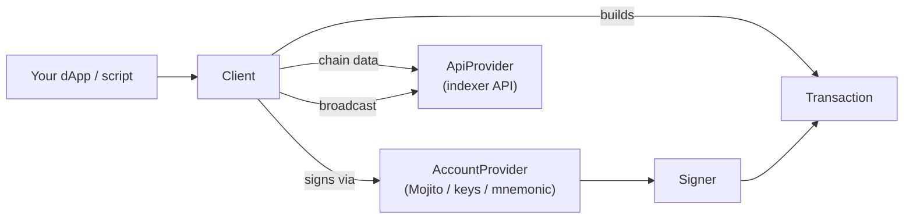

# JavaScript SDK

The `@mintlayer/sdk` package is the JavaScript/TypeScript SDK for Mintlayer. It provides a typed `Client` class that builds and signs transactions through a pluggable account provider, by default the [Mojito Wallet](../../../wallet/mojito-wallet.md) browser extension, or standalone key-based providers for Node.js scripts, bots, and tests.

```bash
npm install @mintlayer/sdk
```

- Works in browsers (dApps) and Node.js (scripts, faucets, bots)
- Type-safe transaction builders for all major Mintlayer transaction types
- Pluggable architecture: swap the wallet extension for private keys or a mnemonic seed without changing application code
- Source: [github.com/mintlayer/mintlayer-connect-sdk](https://github.com/mintlayer/mintlayer-connect-sdk)

## Architecture

The SDK is built around three interfaces. Everything else is an implementation you can replace.

| Component | Purpose |
| --------- | ------- |
| `Client` | High-level API: connection lifecycle, balances, delegations, orders, and ready-made methods for every transaction type |
| `AccountProvider` | Where addresses come from and who signs. Implementations: `MojitoAccountProvider` (browser extension, default), `PrivateKeyAccountProvider`, `MnemonicAccountProvider`, or your own |
| `ApiProvider` | Chain-data backend used for UTXO selection, fees, and queries. `MintlayerApiProvider` targets the [public API](../../../api/index.md) |
| `Signer` | Low-level transaction signing with explicit private keys (also usable on its own) |
| `Transaction` | Transaction object: JSON/binary/hex representations, fee, UTXO selection |
| `WalletState` | Headless wallet state: transaction log, UTXOs, and balances derived from your own sync source |



## Quick start

Connect to the user's Mojito wallet and send coins:

```ts
import { Client } from '@mintlayer/sdk';

const client = await Client.create({ network: 'testnet' });

await client.connect(); // opens the wallet connection prompt

const signedTx = await client.transfer({
  to: 'tmt1q9mfg7d6ul2nt5yhmm7l7r6wwyqkd822rymr83uc',
  amount: 10, // human-readable units
});
```

Without a browser extension (Node.js, scripts, tests), derive an account from a mnemonic or explicit keys:

```ts
import { Client, MnemonicAccountProvider } from '@mintlayer/sdk';

const client = await Client.create({
  network: 'testnet',
  accountProvider: new MnemonicAccountProvider('word1 word2 ... word12', 'testnet'),
});

const signedTx = await client.transfer({ to: 'tmt1q...', amount: 10 });
```

## Guides

| Guide | Contents |
| ----- | -------- |
| [SDK Client](getting-started.md) | Client creation, connection lifecycle, network, events, queries |
| [Account providers](account-providers.md) | Mojito, private-key, mnemonic, and custom providers |
| [Transactions](transactions.md) | Build, sign, broadcast; fees; HTLCs; message signing |
| [Tokens](tokens.md) | Fungible tokens and NFTs: issuance, minting, freezing |
| [Staking](staking.md) | Delegation creation, staking, withdrawal |
| [Orders](orders.md) | On-chain trading orders: create, fill, conclude |
| [Wallet state](wallet-state.md) | Headless UTXO/balance tracking for bots and scanners |

Amounts passed to the SDK are human-readable values; the SDK converts them to atoms internally. For display, use the exported helpers `atomsToDecimal`, `decimalsToAtoms`, and `decimals`.
