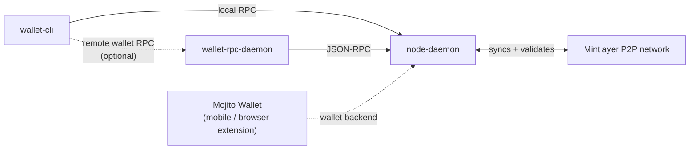

# Getting Started

This page gives you the mental model of how Mintlayer software fits together, and walks you through your first steps: installing, running a node, and setting up a wallet.

## Node vs. wallet

Mintlayer separates chain infrastructure from key management. There are two kinds of software, and it helps to be clear about which one you are running:



In the Node vs. wallet comparison, "Needs the other" cuts both ways for the wallet: `wallet-cli` either runs its wallet RPC server **embedded** (the default, talking to the node directly), or acts as a **client of a separate `wallet-rpc-daemon`** when you point it at one (the recommended setup for [staking in the background](install/install-from-docker.md#staking)).

| | **Node** | **Wallet** |
| --- | -------- | ---------- |
| Executable | `node-daemon` | `wallet-cli` or `wallet-rpc-daemon` |
| What it does | Connects to the P2P network, syncs and validates the full blockchain, exposes a node RPC interface for chain queries and transaction submission | Manages seed phrases, accounts, and keys; creates, signs, and sends transactions; handles staking |
| Holds funds? | No, the node never holds keys or balances | Yes, all key material stays on your machine |
| Needs the other? | Runs standalone | Needs a connection to a node for chain state |

For end users, the [Mojito Wallet](../wallet/mojito-wallet.md) is the recommended option: a non-custodial wallet available as a mobile app (iOS and Android) and as a browser extension. Developers and operators have two more flavors: `wallet-cli` is an interactive command-line application, while the `wallet-rpc-daemon` is a headless wallet exposing a JSON-RPC 2.0 interface, `wallet-cli` can also be used as a client for the daemon, which is the recommended setup for [staking in the background](install/install-from-docker.md#staking). For a graphical server-side interface, the [one-command installer](install/install-web-gui.md) additionally deploys a web wallet UI on top of a node and wallet daemon.

## 1. Install

Pick one of the installation methods:

- **[One-command installer](install/install-web-gui.md)**, full stack (node + wallet daemon + web interface) in Docker. Easiest way to a running system. *(Experimental)*
- **[Binaries](install/install-from-binaries.md)**, pre-built executables.
- **[Docker](install/install-from-docker.md)**, individual containerized services.
- **[From source](install/install-from-source.md)**, build the latest code yourself (advanced).

## 2. Run a node

Start the node daemon attached to mainnet:

```bash
node-daemon mainnet
```

The node connects to peers and synchronizes the full blockchain automatically. While it syncs, it exposes its RPC interface (by default on `127.0.0.1:3030`) and authenticates local clients with an automatically generated `.cookie` file, the wallet uses this to talk to the node, so no manual RPC configuration is needed for a default local setup.

## 3. Set up a wallet

In a second terminal, start the interactive wallet:

```bash
wallet-cli mainnet
```

You will be guided through the initial setup. The essential flow:

1. `createwallet`, generate a new wallet (write down the seed phrase; there is no recovery without it)
2. `account-create`, create an account
3. `address-new`, generate a receive address
4. `address-show`, list your addresses

Full command documentation lives in the [Wallet CLI reference](../wallet/cli/commands.md); every command also has its own page in that section.

## 4. What next?

- [Issue and manage a token](../guides/cli/issue-new-token.md), create your own MLS-01 token
- [Manage a staking pool](../guides/cli/managing-a-staking-pool.md), participate in consensus and earn rewards
- [Wallet RPC](../wallet/rpc/overview.md), automate wallets programmatically
- [Developer Setup](../build/development.md), RPC ports, authentication, and APIs at a glance
- [Building on Mintlayer](build/index.md), SDKs, wallet integration, and APIs for developers
