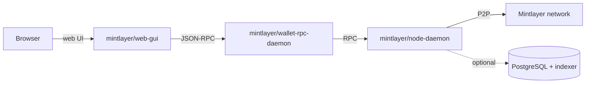

# One-Command Installer (Web GUI)

import Tabs from '@theme/Tabs';
import TabItem from '@theme/TabItem';

:::note[Experimental]

This installation method is new and still experimental. It is subject to change, report any issues on [GitHub](https://github.com/mintlayer/mintlayer-core/issues).

:::

[get.mintlayer.org](https://get.mintlayer.org) provides a one-command installer that sets up a **full Mintlayer stack in Docker**: a complete node, the wallet daemon, and a browser-based web interface, with an interactive setup wizard, so there are no config files to edit manually.

## Install

<Tabs>
  <TabItem value="terminal" label="Terminal" default>

```bash
bash <(curl -sSL https://get.mintlayer.org/linux.sh)
```

  </TabItem>
  <TabItem value="agent" label="AI agent">

Paste the prompt from [get.mintlayer.org](https://get.mintlayer.org) (select the **Agent** tab and copy it) into your AI coding agent, Claude Code, Codex, Cursor, etc. The agent downloads the installer, runs it, and verifies the stack autonomously.

  </TabItem>
</Tabs>

The installer supports **Linux and macOS** (with Windows support via PowerShell 5.1+ documented on the site).

## What gets installed

The installer deploys this stack:



| Component | Image | Description |
| --------- | ----- | ----------- |
| Full node | `mintlayer/node-daemon` | Complete Mintlayer node, syncs the full blockchain automatically (RPC on port 3030) |
| Wallet daemon | `mintlayer/wallet-rpc-daemon` | Non-custodial headless wallet with a JSON-RPC 2.0 interface, keys never leave your machine |
| Web interface | `mintlayer/web-gui` | Browser-based wallet UI, protected by password and TOTP 2FA |
| PostgreSQL + indexer | n/a | Optional; enables token management |

## Requirements

- Linux or macOS
- Docker Desktop or Docker Engine
- Docker Compose v2
- Python 3
- ~50 GB free disk space (mainnet) or ~5 GB (testnet)

## Next steps

Once the stack is running, open the web interface to create or restore a wallet, or interact with the node and wallet directly: see the [Node](/docs/node) and [Wallet RPC](/docs/wallet/rpc) documentation.
