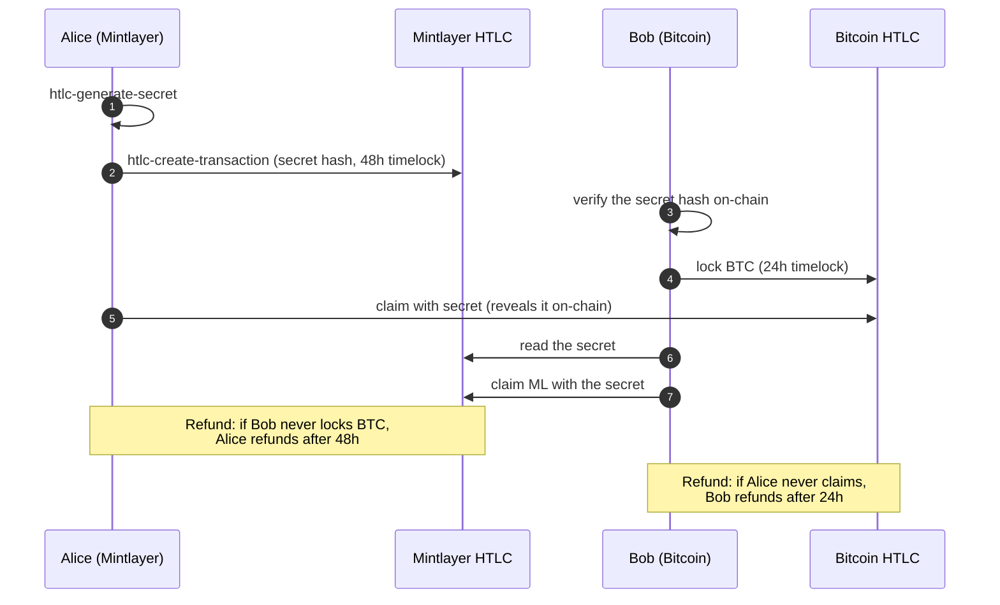

An atomic swap lets two parties exchange assets on different blockchains without trusting each other and without any intermediary. Either the swap completes in full for both sides, or both sides can reclaim their funds. There is no way for one party to take the other's funds without fulfilling their side.

This guide walks through a cross-chain atomic swap between Mintlayer (ML coins or tokens) and Bitcoin, using Hash Time-Locked Contracts (HTLCs).

---

## How It Works

An HTLC locks funds with two conditions:

- **Spend path**: the recipient can claim the funds by revealing a secret whose hash was committed to at lock time.
- **Refund path**: the sender can reclaim the funds after a timelock expires, if the secret was never revealed.

In a cross-chain atomic swap:

1. **Alice** generates a secret and shares only its hash.
2. Alice locks her ML funds in an HTLC on Mintlayer, using the hash.
3. **Bob** locks his BTC in an HTLC on Bitcoin, using the same hash.
4. Alice claims Bob's BTC by revealing the secret, this makes the secret public on the Bitcoin blockchain.
5. Bob uses the now-public secret to claim Alice's ML funds.

If either party fails to act, both can reclaim their funds once their respective timelocks expire.

---

## Prerequisites

- Alice: `wallet-cli` connected to a Mintlayer node, with ML coins or tokens to swap.
- Bob: a Bitcoin wallet that supports HTLC scripts (e.g. via Bitcoin CLI or a compatible tool).
- Both parties must agree off-chain on: amounts, exchange rate, and timelock durations before starting.

---

## Timelock Planning

Bob's Bitcoin HTLC timelock must **expire before** Alice's Mintlayer timelock. This ensures that if something goes wrong after Bob locks his BTC, Alice cannot wait for her timelock to refund on Mintlayer while also claiming Bob's BTC using the secret.

A safe configuration:
- **Alice's Mintlayer HTLC**: 48 hours (`seconds(172800)`)
- **Bob's Bitcoin HTLC**: 24 hours

This gives Bob time to claim ML after Alice reveals the secret, while ensuring Alice can refund on Mintlayer if the swap falls through.

---

## Step-by-Step Walkthrough

The full swap, including the refund paths:



Bob's Bitcoin timelock (24 hours) must be **shorter** than Alice's Mintlayer timelock (48 hours): see [Timelock Planning](#timelock-planning).

### Step 1: Alice generates the secret

Alice generates a random secret:

```
htlc-generate-secret
```

Example output:
```
a3f1c2...9d4e  (64-char hex string)
```

Alice computes its hash:

```
htlc-calc-secret-hash <secret_hex>
```

Example output:
```
8b2e4f...1a7c  (64-char hex string)
```

Alice shares the **hash** with Bob. She keeps the **secret** private.

---

### Step 2: Alice locks ML on Mintlayer

Alice creates the HTLC on Mintlayer, locking her ML coins (or tokens):

```
htlc-create-transaction coin <ml_amount> <secret_hash> <bob_ml_address> seconds(172800) <alice_ml_address>
```

Arguments:
- `coin`, currency to lock (or a token id)
- `<ml_amount>`, amount Alice is offering
- `<secret_hash>`, hash from Step 1
- `<bob_ml_address>`, Bob's Mintlayer address (can claim with the secret)
- `seconds(172800)`, 48-hour refund timelock for Alice
- `<alice_ml_address>`, Alice's refund address

This returns an unsigned transaction hex. Broadcast it:

```
node-submit-transaction <tx_hex>
```

Alice shares the Mintlayer transaction id with Bob so he can verify the HTLC on-chain.

---

### Step 3: Bob verifies the Mintlayer HTLC

Bob checks the Mintlayer HTLC before locking his BTC:

- Confirms the locked amount matches the agreed amount.
- Confirms the secret hash matches the one Alice shared.
- Confirms his Mintlayer address is the spend address.
- Confirms Alice's refund timelock is long enough (giving him time to act).

Only after verification should Bob proceed.

---

### Step 4: Bob locks BTC on Bitcoin

Bob creates a Bitcoin HTLC using the **same secret hash**, with:
- Alice's Bitcoin address as the spend address (she will reveal the secret here).
- Bob's Bitcoin address as the refund address.
- A **shorter** timelock than Alice's (e.g. 24 hours).

This step uses Bitcoin tooling (Bitcoin Core, a HTLC-capable wallet, or a script). The mechanics are the same as on Mintlayer: the same secret hash is used and the spend/refund structure is symmetric.

Bob shares the Bitcoin transaction id with Alice.

---

### Step 5: Alice claims Bob's BTC

Alice verifies Bob's Bitcoin HTLC:
- Confirms the locked BTC amount.
- Confirms the secret hash matches.
- Confirms her Bitcoin address is the spend address.
- Confirms Bob's timelock is shorter than hers.

Alice then spends the Bitcoin HTLC by revealing the secret. This publishes the secret on the Bitcoin blockchain.

---

### Step 6: Bob claims Alice's ML

The secret is now publicly visible from Alice's Bitcoin claim transaction. Bob uses it to spend the Mintlayer HTLC:

```
utxo-spend tx(<ml_txid>,0) <bob_ml_address> <secret_hex>
```

- `tx(<ml_txid>,0)`, the UTXO from Alice's Mintlayer HTLC transaction
- `<bob_ml_address>`, Bob's Mintlayer address
- `<secret_hex>`, the secret revealed by Alice on Bitcoin

The swap is complete.

---

## Refund Paths (If the Swap Fails)

### Alice refunds (Mintlayer)

If Bob never locks BTC, or Alice decides not to proceed, Alice waits for the 48-hour timelock to expire, then refunds:

```
utxo-spend tx(<ml_txid>,0) <alice_ml_address>
```

Omitting the secret triggers the refund path. Alice's refund address must be owned by her current account.

### Bob refunds (Bitcoin)

If Alice never reveals the secret (never claims Bob's BTC), Bob waits for his 24-hour timelock to expire and reclaims his BTC using his Bitcoin wallet's refund mechanism.

---

## Security Considerations

- **Never reuse a secret** across multiple swaps.
- **Verify all HTLC parameters** before locking funds, check amounts, hash, addresses, and timelocks.
- **Bob's timelock must expire before Alice's.** If both timelocks are equal, Alice could theoretically claim BTC and then refund ML simultaneously near the expiry boundary.
- **Act promptly.** Once Alice claims BTC and reveals the secret, Bob must claim ML before Alice's Mintlayer timelock expires. With a 48h/24h split this is comfortable, but don't delay.
- **Do not lose the secret.** Alice must keep the secret safe until she is ready to claim BTC. If she loses it, she cannot complete the swap and Bob cannot claim ML either, both parties will need to wait for their refund timelocks.

---

## Summary of Roles

| Step | Alice (ML → BTC) | Bob (BTC → ML) |
|---|---|---|
| 1 | Generate secret, compute hash, share hash | Receive hash |
| 2 | Lock ML in Mintlayer HTLC (48h refund) | Verify Mintlayer HTLC |
| 3 | Verify Bitcoin HTLC | Lock BTC in Bitcoin HTLC (24h refund) |
| 4 | Claim BTC, revealing secret | Watch Bitcoin, extract secret |
| 5 | n/a | Claim ML using the revealed secret |

---

## Quick Reference

| Task | Command |
|---|---|
| Generate HTLC secret | `htlc-generate-secret` |
| Compute secret hash | `htlc-calc-secret-hash <secret>` |
| Create Mintlayer HTLC | `htlc-create-transaction <currency> <amount> <hash> <spend_address> <timelock> <refund_address>` |
| Broadcast transaction | `node-submit-transaction <tx_hex>` |
| Claim HTLC (spend) | `utxo-spend tx(<txid>,<index>) <address> <secret>` |
| Refund HTLC (timeout) | `utxo-spend tx(<txid>,<index>) <address>` |

---

## Related Pages

- [`htlc-create-transaction`](../../wallet/cli/commands/htlc/htlc-create-transaction-command-guide.md)
- [`htlc-generate-secret`](../../wallet/cli/commands/htlc/htlc-generate-secret-command-guide.md)
- [`htlc-calc-secret-hash`](../../wallet/cli/commands/htlc/htlc-calc-secret-hash-command-guide.md)
- [`utxo-spend`](../../wallet/cli/commands/transactions/utxo-spend-command-guide.md)
- [`node-submit-transaction`](../../wallet/cli/commands/node-control/node-submit-transaction-command-guide.md)
