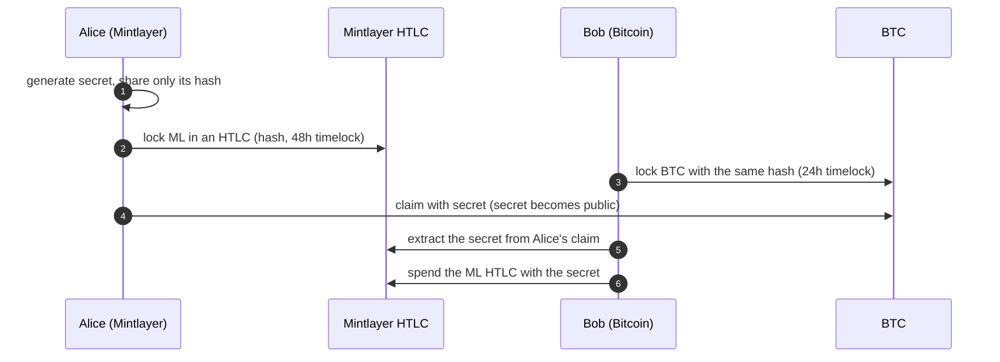

# Atomic Swap

The Go SDK path to cross-chain atomic swaps. The same workflow in JavaScript lives in the [JavaScript guides](../javascript/atomic-swap.md); the wallet-cli guide [Atomic Swap with Bitcoin (HTLC)](../cli/atomic-swap-with-bitcoin.md) explains the full protocol: roles, the secret/hash flow, and [timelock planning](../cli/atomic-swap-with-bitcoin.md#timelock-planning) (the Bitcoin timelock must be shorter than the Mintlayer one). This page shows how to build the **Mintlayer side** with the `wasm` package.



If a party stalls, the HTLC's refund path returns the funds once the timelock expires.

## Locking funds in an HTLC

```go
import mintlayer "github.com/mintlayer/go-sdk/wasm"

c, _ := mintlayer.New(ctx)

htlcOutput, err := c.EncodeOutputHTLC(
    mintlayer.NewAmount("100000000000"),
    nil,                       // token ID: nil for the base coin
    secretHash,
    spendAddress,              // where a successful claim pays out
    refundAddress,             // where a refund returns
    refundTimelock,            // encoded timelock
    mintlayer.Mainnet,
)
```

Assemble the transaction with the regular input/output encoders and submit; see [Building Transactions](../../build/sdks/go/transactions.md).

## Claiming and refunding

The claim embeds the preimage in the witness; the refund path is available after the timelock:

```go
// Spend (claim) the HTLC, embedding the secret
witness, err := c.EncodeWitnessHTLCSpend(
    mintlayer.SigHashAll,
    privateKey, inputOwnerDest,
    transaction, inputUtxos, inputIndex,
    secret,
    mintlayer.TxAdditionalInfo{},
    blockHeight, mintlayer.Mainnet,
)

// Refund after the timelock with a single-signature refund address
witness, err = c.EncodeWitnessHTLCRefundSingleSig(
    mintlayer.SigHashAll,
    privateKey, inputOwnerDest,
    transaction, inputUtxos, inputIndex,
    mintlayer.TxAdditionalInfo{},
    blockHeight, mintlayer.Mainnet,
)
```

## Learning the counterparty's secret

When the counterparty claims their HTLC, the secret is revealed on-chain. Extract it from the signed claim transaction:

```go
secret, err := c.ExtractHTLCSecret(signedTx, true, htlcOutpointSourceId, htlcOutputIndex)
```

## Checklist

- Agree off-chain on amounts, rate, and **timelock durations** before locking anything.
- Bitcoin timelock strictly shorter than the Mintlayer timelock.
- Only the hash is shared; the secret is revealed by the first claim.
- Verify the on-chain HTLC (amount, addresses, timelock) before locking the other side.
