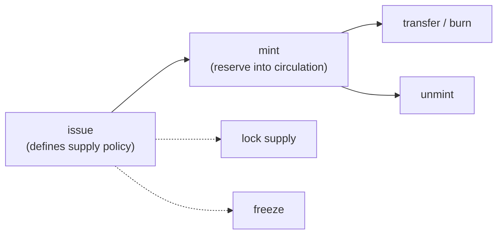

# Issue a Token

This guide covers the full MLS-01 token lifecycle in Go: issuing, minting, transferring, and managing supply and authority with the Go SDK. The same workflow in JavaScript lives in the [JavaScript guides](../javascript/issue-token.md); the wallet-cli version, which explains the underlying concepts (token id, authority address, reserve vs circulating supply), is [Issue a new token](../cli/issue-new-token.md).

Prerequisites: a funded wallet and a running `wallet-rpc-daemon` plus indexer (see [Developer Setup](../../build/development.md) for ports and authentication).



## Issuing

```go
import "github.com/mintlayer/go-sdk/wallet"

wc := wallet.New("http://127.0.0.1:3034")

authorityAddr, err := wc.NewAddress(ctx, 0)

result, err := wc.IssueToken(ctx, wallet.IssueTokenParams{
    Account:            0,
    DestinationAddress: authorityAddr,
    Metadata: wallet.TokenMetadata{
        TokenTicker:      "MYTOKEN",
        NumberOfDecimals: 8,
        MetadataURI:      "https://example.com/mytoken.json",
        TokenSupply:      wallet.TokenSupply{Type: "Lockable"},
        IsFreezable:      true,
    },
})
fmt.Printf("token id: %s  tx: %s\n", result.TokenID, result.TxID)
```

For a fixed supply, cap it at issuance:

```go
TokenSupply: wallet.TokenSupply{
    Type:    "Fixed",
    Content: &wallet.Amount{Atoms: "1000000"}, // hard cap
},
```

The `DestinationAddress` becomes the **token authority**: the key that controls future operations (minting, freezing, authority transfer). Keep it secure.

## Metadata

Publish metadata at the metadata URI following the [Token Metadata Standards](../../reference/token-standards/mls01.md) (MLS-01 schema) so wallets and explorers can render your token. The URI can be updated later by the authority.

## Minting and unminting

Wait for the issuance transaction to confirm first. Minting moves tokens from the reserve into circulation; unminting reverses it.

```go
mintResult, err := wc.MintTokens(ctx, wallet.MintParams{
    Account: 0, TokenID: result.TokenID,
    Address: recipientAddr,
    Amount:  wallet.Amount{Atoms: "100000"}, // smallest units
})

_, err = wc.UnmintTokens(ctx, wallet.UnmintParams{
    Account: 0, TokenID: result.TokenID,
    Amount: wallet.Amount{Atoms: "50000"},
})
```

## Transferring and burning

```go
_, err = wc.SendToken(ctx, wallet.TokenSendParams{
    Account: 0, TokenID: result.TokenID,
    Address: recipientAddr,
    Amount:  wallet.Amount{Atoms: "10000"},
})
```

## Authority, freeze, and supply lock

All management operations require the token authority key:

```go
_, err = wc.LockTokenSupply(ctx, wallet.LockSupplyParams{AccountIndex: 0, TokenID: result.TokenID}) // irreversible

_, err = wc.FreezeToken(ctx, wallet.FreezeParams{Account: 0, TokenID: result.TokenID, IsUnfreezable: true})
_, err = wc.UnfreezeToken(ctx, wallet.UnfreezeParams{Account: 0, TokenID: result.TokenID})
_, err = wc.ChangeTokenAuthority(ctx, wallet.ChangeAuthorityParams{Account: 0, TokenID: result.TokenID, Address: newAuthorityAddr})
```

## Reading token state

```go
import "github.com/mintlayer/go-sdk/indexer"

idx := indexer.New("http://127.0.0.1:3000")

token, err := idx.GetToken(ctx, result.TokenID)
fmt.Printf("ticker: %s  circulating: %s  locked: %v  frozen: %v\n",
    token.TokenTicker, token.CirculatingSupply.Decimal, token.IsLocked, token.Frozen)
```

## Manual transaction building

For full custody without the wallet daemon, the `wasm` package encodes issuance, mint, and freeze inputs/outputs directly, and exposes the protocol fee functions (`FungibleTokenIssuanceFee`, `TokenSupplyChangeFee`, `TokenFreezeFee`, `TokenChangeAuthorityFee`). See [Go SDK: Tokens](../../build/sdks/go/tokens.md#building-token-transactions-manually) and [Forging custom transactions](custom-transactions.md).
