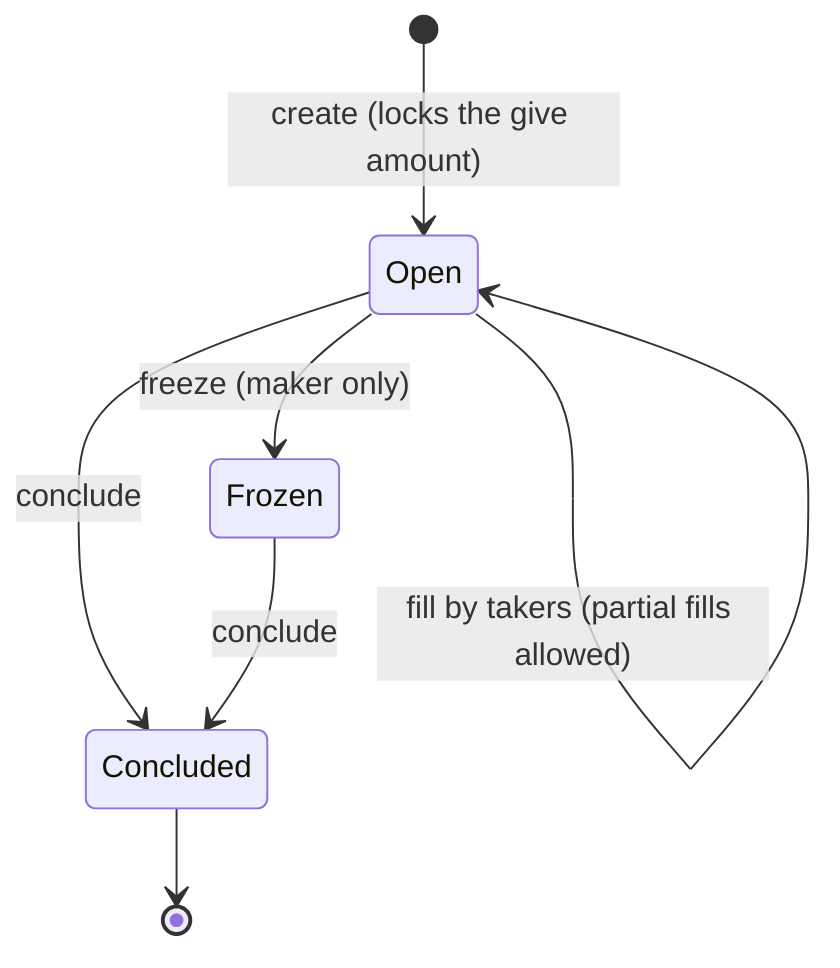

# Trading with Orders

The Go SDK path to Mintlayer's on-chain order trading. The same workflow in JavaScript lives in the [JavaScript guides](../javascript/trading-with-orders.md); the wallet-cli version, with the order model (give/ask, conclude key, freeze semantics), is [Trading with orders](../cli/trading-with-orders.md).

An order locks a `give` amount on-chain and asks for an `ask` amount in return. Anyone may fill it (fully or partially); the maker can freeze it and conclude it to reclaim the remainder:



## Creating an order

The wallet sub-client has no high-level order methods; orders are built with the `wasm` encoders:

```go
import mintlayer "github.com/mintlayer/go-sdk/wasm"

c, _ := mintlayer.New(ctx)

// Outputs: the ask request plus the give amount locked by the order
createOrderOutput, err := c.EncodeCreateOrderOutput(
    mintlayer.NewAmount("100"), // give amount
    askToken, askAmount,
    concludeAddress,
    mintlayer.Mainnet,
)

// The order id is derived from the built inputs
orderID, err := c.GetOrderId(encodedInputs, mintlayer.Mainnet)
```

Assemble and submit the transaction with the [wasm transaction flow](../../build/sdks/go/transactions.md).

## Discovering orders

```go
import "github.com/mintlayer/go-sdk/indexer"

idx := indexer.New("http://127.0.0.1:3000")

orders, err := idx.ListOrders(ctx, indexer.PageOpts{Items: 50})
pair, err := idx.ListOrdersByPair(ctx, "Coin", "tmltk1...", indexer.PageOpts{Items: 50})

order, err := idx.GetOrder(ctx, orderID)
fmt.Printf("ask: %v  give: %v\n", order.AskBalance, order.GiveBalance)
```

The node RPC also exposes `OrderInfo` and `OrdersInfoByCurrencies`; see [Go SDK: Node](../../build/sdks/go/node.md#token-and-order-info).

## Filling an order

Encode the fill input against the order's current nonce, then sign and submit:

```go
fillInput, err := c.EncodeInputForFillOrder(
    orderID,
    mintlayer.NewAmount("5"),
    destinationAddress,
    nonce, currentBlockHeight,
    mintlayer.Mainnet,
)
```

A fill input needs **no signature**: use `EncodeWitnessNoSignature` for it when assembling the witness bytes.

## Concluding and freezing (maker)

```go
concludeInput, err := c.EncodeInputForConcludeOrder(orderID, nonce, currentBlockHeight, mintlayer.Mainnet)
freezeInput, err := c.EncodeInputForFreezeOrder(orderID, currentBlockHeight, mintlayer.Mainnet)
```

Concluding returns the unclaimed `give` remainder plus any accumulated `ask` balance to the order's conclude destination. Only the maker can freeze or conclude.

To **update** an existing order (new price or amounts), compose a transaction that consumes the conclude-order input and re-creates the order: see [Composing UTXOs](utxo-composition.md).
