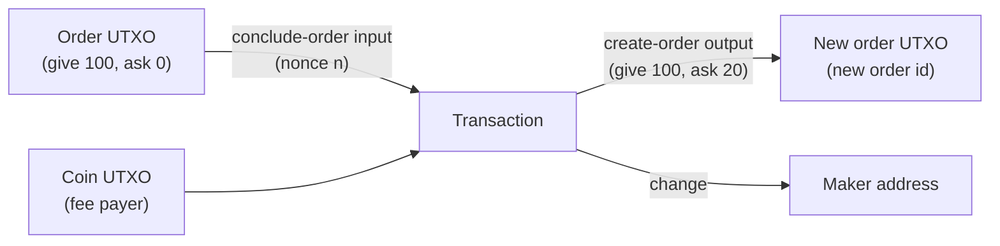

# Composing UTXOs: Updating an Order

Mintlayer is a UTXO chain: **there is no mutable state**. A DEX order is an unspent output, and every protocol object behaves the same way, so "updating" an order means spending it and re-creating it *in the same transaction*. This atomic spend-and-recreate pattern is the essence of UTXO composition.

## The pattern

An order lives as a `CreateOrder` output holding the `give` balance plus any accumulated `ask` balance. Its spend authority is the maker, gated by the order's **nonce**. To update the order (new price, new amounts), build one transaction that:

1. consumes the order via a **conclude-order input** (this releases the whole order balance), and
2. re-locks the funds into a fresh **create-order output** with the new parameters.



Two consequences worth internalizing:

- The **new order gets a new ID** (IDs are derived from inputs, see [predicting IDs](custom-transactions.md#predicting-ids)). Publish the new ID and retire the old one.
- If the transaction fails or is dropped, nothing changed: the old order is still live and its nonce unspent.

## The ingredients

| Piece | Encoder | Source of truth |
| ----- | ------- | --------------- |
| Conclude input | `EncodeInputForConcludeOrder(orderID, nonce, currentBlockHeight, network)` | `Nonce` from the indexer's order record |
| New order output | `EncodeCreateOrderOutput(askAmount, askTokenID, giveAmount, giveTokenID, concludeAddress, network)` | Your new price/amounts |
| Surplus / change outputs | `EncodeOutputTransfer` / `EncodeOutputTokenTransfer` | Old balance minus new give amount |
| Fee input | `EncodeInputForUtxo` | A coin UTXO you own |
| Witness for the conclude input | `EncodeWitness` with `TxAdditionalInfo` | Order balances from the indexer |
| Witness for the coin input | `EncodeWitness` | n/a |

## Fetch the order state

```go
import "github.com/mintlayer/go-sdk/indexer"

idxClient := indexer.New("http://127.0.0.1:3000")

order, err := idxClient.GetOrder(ctx, oldOrderID)
if err != nil {
    log.Fatal(err)
}
fmt.Printf("give: %s  ask: %s  nonce: %d\n",
    order.GiveBalance.Atoms(), order.AskBalance.Atoms(), order.Nonce)
```

The `AskBalance` matters: any asks accumulated from takers are part of the order you are concluding, so the new order (or a change output) must account for them.

## Build the transaction

Example: top up the `give` side and raise the ask. Old order: give 100 tokens / ask 10 coins. New order: give 150 / ask 12. The conclude releases 100 tokens + accumulated asks; a separate token UTXO adds the extra 50.

```go
// 1. Consume the old order
concludeInput, err := c.EncodeInputForConcludeOrder(
    oldOrderID, order.Nonce, tip.BlockHeight, mintlayer.Mainnet)

// 2. Fee payer
srcID, err := c.EncodeOutpointSourceId(feeTxIDBytes, mintlayer.SourceTransaction)
feeInput, err := c.EncodeInputForUtxo(srcID, 0)

// 3. Re-create the order with updated parameters
var giveToken, askToken *string
newOrderOutput, err := c.EncodeCreateOrderOutput(
    mintlayer.NewAmount("12"), askToken,   // ask 12 coins (nil token id = coin)
    mintlayer.NewAmount("150"), giveToken, // give 150 tokens
    concludeAddress,                       // same conclude destination
    mintlayer.Mainnet,
)

// 4. Any balance not re-locked returns via change outputs
changeOutput, err := c.EncodeOutputTransfer(
    mintlayer.NewAmount("2000000000"), makerAddr, mintlayer.Mainnet) // fee change

tx, err := c.EncodeTransaction(
    append(concludeInput, feeInput...),
    append(newOrderOutput, changeOutput...),
    0,
)
```

Token inputs (e.g. a UTXO holding the additional 50 tokens) encode with `EncodeInputForUtxo` like any other spend; only the *outputs* distinguish coin from token value.

## Sign it

The conclude input's sighash requires the order's balances via `TxAdditionalInfo`: this is the part that differs from a plain transfer:

```go
additionalInfo := mintlayer.TxAdditionalInfo{
    OrderInfo: map[string]mintlayer.OrderInfo{
        oldOrderID: {
            InitiallyAsked: order.InitiallyAsked,
            InitiallyGiven: order.InitiallyGiven,
            AskBalance:     order.AskBalance,
            GiveBalance:    order.GiveBalance,
        },
    },
}

var witnessBytes []byte
for i := 0; i < 2; i++ { // one witness per input, in input order
    w, err := c.EncodeWitness(
        mintlayer.SigHashAll,
        makerKey,
        makerAddr,
        tx,
        allUtxoBytes,
        uint32(i),
        additionalInfo,      // required for the order input
        tip.BlockHeight,
        mintlayer.Mainnet,
    )
    if err != nil {
        log.Fatal(err)
    }
    witnessBytes = append(witnessBytes, w...)
}

signedTx, err := c.EncodeSignedTransaction(tx, witnessBytes)
```

Submit via the indexer or node as usual, then predict and store the new order ID:

```go
newOrderID, err := c.GetOrderId(append(concludeInput, feeInput...), mintlayer.Mainnet)
```

## Variations of the same pattern

The conclude-then-recreate transaction is one instance of a general tool. With the same encoders you can:

- **Cancel an order**: conclude input, no create-order output; the balance flows to change outputs.
- **Self-fill and requote**: conclude input + `FillOrder`-style split: partially fill your own order and re-create a smaller one. (A pure fill by a taker uses `EncodeInputForFillOrder` and needs **no signature** for that input, `EncodeWitnessNoSignature`.)
- **Freeze before restructuring**: `EncodeInputForFreezeOrder` stops takers while you prepare the replacement transaction.
- **Chain protocol objects**: the same spend-and-recreate logic composes delegations (withdraw input + `EncodeOutputDelegateStaking` output) and any future output type.

:::note

Exactly which balances must be re-assigned to which outputs is enforced by consensus, not by the encoders, the runtime tells you *if* a transaction is invalid, the indexer tells you *what* the balances are, and the composition is yours to design.

:::

For the order model itself (give/ask, conclude key, freeze semantics), see [Trading with Orders](trading-with-orders.md) and the wallet-cli guide [Trading with orders](../cli/trading-with-orders.md).
