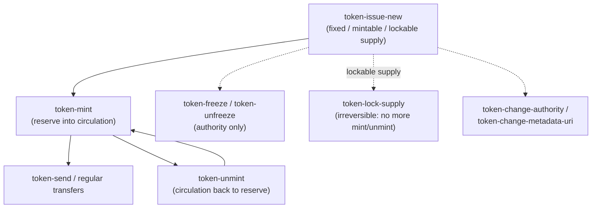

This guide covers the full lifecycle of a fungible token on Mintlayer, from issuance through supply management, transfers, and optional freeze or supply locking.

## Prerequisites

- A running, synced `node-daemon`
- `wallet-cli` connected to the node
- A small amount of TML to cover transaction fees

---

## Concepts

**Token id**: A unique identifier assigned to your token when it is issued. All subsequent management commands reference this id.

**Authority address**: The address whose key controls all management operations, minting, unminting, freezing, changing the metadata URI, and transferring authority. Keep the corresponding key secure.

**Circulating supply vs total supply**: Issuing a token defines its properties and maximum supply, but tokens are not spendable until they are minted into the circulating supply. Minting moves tokens from the reserve into circulation; unminting reverses this.

The token lifecycle, and where each management command fits:



---

## Part 1: Issuing a Token

### Decide your supply model

Before issuing, decide how you want supply to work:

| Supply type | What it means |
|---|---|
| `fixed(<amount>)` | Total supply is set at issuance and can never change. No minting or unminting is possible. |
| `lockable` | Supply starts unlimited but can be permanently locked later with `token-lock-supply`, fixing it at the current circulating amount. |
| `unlimited` | Supply is always unlimited. Minting and unminting are always available. |

### Issue the token

```
token-issue-new <TOKEN_TICKER> <NUMBER_OF_DECIMALS> <METADATA_URI> <AUTHORITY_ADDRESS> <TOKEN_SUPPLY> <IS_FREEZABLE>
```

Examples:

```
# Fixed supply of 1,000,000 tokens with 8 decimal places, not freezable
token-issue-new MYTKN 8 https://example.com <authority_address> fixed(1000000) not-freezable

# Lockable supply (start unlimited, lock later), freezable
token-issue-new MYTKN 8 https://example.com <authority_address> lockable freezable

# Unlimited supply, not freezable
token-issue-new MYTKN 8 https://example.com <authority_address> unlimited not-freezable
```

After the transaction is confirmed, the output will include the **token id**. Record it, you will need it for every subsequent operation.

### Fixed-supply tokens

If you issued with `fixed(<amount>)`, the full supply is created at issuance and sent directly to the authority address. No minting step is needed. Skip to [Part 3: Transferring Tokens](#part-3-transferring-tokens).

---

## Part 2: Minting and Unminting

For `lockable` and `unlimited` supply tokens, tokens must be minted before they can be transferred.

### Mint tokens into circulation

```
token-mint <token_id> <recipient_address> <amount>
```

The authority key must be in the selected account. Minted tokens are sent to `<recipient_address>`, this can be any address, including one in the same wallet.

### Unmint tokens

Unminting reduces the circulating supply and returns the tokens to the issuer's control. The wallet must hold both the tokens being unminted and the authority key.

```
token-unmint <token_id> <amount>
```

### Lock the supply permanently

If you issued with `lockable` supply and want to make the current circulating amount the permanent total supply:

```
token-lock-supply <token_id>
```

**This is irreversible.** After locking, minting and unminting are no longer possible. Use this when you are ready to commit to a fixed supply.

---

## Part 3: Transferring Tokens

Send tokens to any address:

```
token-send <token_id> <destination_address> <amount>
```

Transaction fees are paid in TML, not in the token being sent. The wallet calculates fees automatically.

---

## Part 4: Ongoing Management

### Update the metadata URI

```
token-change-metadata-uri <token_id> <new_uri>
```

Use this to update the URL pointing to your token's website, documentation, or media.

### Transfer authority to another address

```
token-change-authority <token_id> <new_authority_address>
```

After this transaction is confirmed, the old authority key loses all management rights. Make sure the new address is accessible before transferring.

### Freeze the token

Freezing blocks all operations on the token for all users. This requires the token to have been issued with `freezable`.

```
# Freeze but allow unfreezing later
token-freeze <token_id> unfreezable

# Freeze permanently: cannot be reversed
token-freeze <token_id> not-unfreezable
```

### Unfreeze the token

Only possible if the token was frozen with the `unfreezable` option:

```
token-unfreeze <token_id>
```

---

## Supply Model Decision Summary

| Requirement | Recommended supply type | Freezable? |
|---|---|---|
| Fixed from day one, no changes ever | `fixed(<amount>)` | Either |
| Start with minting flexibility, then lock | `lockable` | Either |
| Always mintable, no cap | `unlimited` | Either |
| Need emergency stop capability | Any | `freezable` |
| No central freeze risk | Any | `not-freezable` |

---

## Quick Reference

| Task | Command |
|---|---|
| Issue a token | `token-issue-new <ticker> <decimals> <uri> <authority> <supply> <freezable>` |
| Mint tokens | `token-mint <token_id> <address> <amount>` |
| Unmint tokens | `token-unmint <token_id> <amount>` |
| Lock supply permanently | `token-lock-supply <token_id>` |
| Send tokens | `token-send <token_id> <address> <amount>` |
| Update metadata URI | `token-change-metadata-uri <token_id> <uri>` |
| Transfer authority | `token-change-authority <token_id> <new_authority>` |
| Freeze token | `token-freeze <token_id> unfreezable\|not-unfreezable` |
| Unfreeze token | `token-unfreeze <token_id>` |

---

## Related Pages

- [`token-issue-new`](../wallet/cli/commands/tokens/token-issue-new-command-guide.md)
- [`token-mint`](../wallet/cli/commands/tokens/token-mint-command-guide.md)
- [`token-unmint`](../wallet/cli/commands/tokens/token-unmint-command-guide.md)
- [`token-lock-supply`](../wallet/cli/commands/tokens/token-lock-supply-command-guide.md)
- [`token-send`](../wallet/cli/commands/tokens/token-send-command-guide.md)
- [`token-freeze`](../wallet/cli/commands/tokens/token-freeze-command-guide.md)
- [`token-unfreeze`](../wallet/cli/commands/tokens/token-unfreeze-command-guide.md)
- [`token-change-authority`](../wallet/cli/commands/tokens/token-change-authority-command-guide.md)
- [`token-change-metadata-uri`](../wallet/cli/commands/tokens/token-change-metadata-uri-command-guide.md)
- [`token-nft-issue-new`](../wallet/cli/commands/tokens/token-nft-issue-new-command-guide.md)
