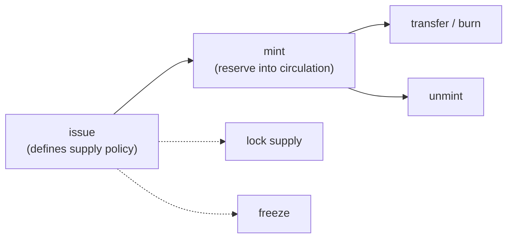

# Issue a Token

This guide covers the full MLS-01 token lifecycle in JavaScript: issuing, minting, transferring, and managing supply and authority with `@mintlayer/sdk`. The same workflow in Go lives in the [Go guides](../go/issue-token.md); the wallet-cli version, which explains the underlying concepts (token id, authority address, reserve vs circulating supply), is [Issue a new token](../cli/issue-new-token.md).

Prerequisites: `npm install @mintlayer/sdk` and a connected client; see [Getting Started](../../build/sdks/javascript/getting-started.md) and [account providers](../../build/sdks/javascript/account-providers.md) pages for running outside a browser.



## Issuing

```ts
import { Client } from '@mintlayer/sdk';

const client = await Client.create({ network: 'testnet' });
await client.connect();

const signedTx = await client.issueToken({
  token_ticker: 'MYTOKEN',
  number_of_decimals: 8,
  metadata_uri: 'https://example.com/mytoken.json',
  is_freezable: true,
  supply_type: 'Lockable', // 'Unlimited' | 'Lockable' | 'Fixed'
  // supply_amount: 1000000,   // required for 'Fixed'
  authority: client.getAddresses().receiving[0],
});
```

The `authority` address becomes the **token authority**: the key that controls future operations (minting, freezing, authority transfer). Keep it secure.

## Metadata

Publish metadata at the metadata URI following the [Token Metadata Standards](../../reference/token-standards/mls01.md) (MLS-01 schema) so wallets and explorers can render your token. The URI can be updated later by the authority.

## Minting and unminting

Wait for the issuance transaction to confirm first. Minting moves tokens from the reserve into circulation; unminting reverses it.

```ts
await client.mintToken({ token_id: 'tmltk1...', amount: 1000, destination: 'tmt1q...' });
await client.unmintToken({ token_id: 'tmltk1...', amount: 500 });
```

## Transferring and burning

```ts
await client.transfer({ to: 'tmt1q...', amount: 10, token_id: 'tmltk1...' });
await client.burn({ token_id: 'tmltk1...', amount: 25 });
```

## Authority, freeze, and supply lock

All management operations require the token authority key:

```ts
await client.lockTokenSupply({ token_id: 'tmltk1...' }); // irreversible
await client.freezeToken({ token_id: 'tmltk1...', is_unfreezable: false });
await client.unfreezeToken({ token_id: 'tmltk1...' });
await client.changeTokenAuthority({ token_id: 'tmltk1...', new_authority: 'tmt1q...' });
await client.changeMetadataUri({ token_id: 'tmltk1...', new_metadata_uri: 'https://...' });
```

## Reading token state

Tokens owned by the connected addresses are listed by `client.getTokensOwned()`; per-token balances via `client.getBalances()`. Every method above also exists as a `buildX` variant returning an unsigned transaction; see [Transactions](../../build/sdks/javascript/transactions.md#manual-building).
