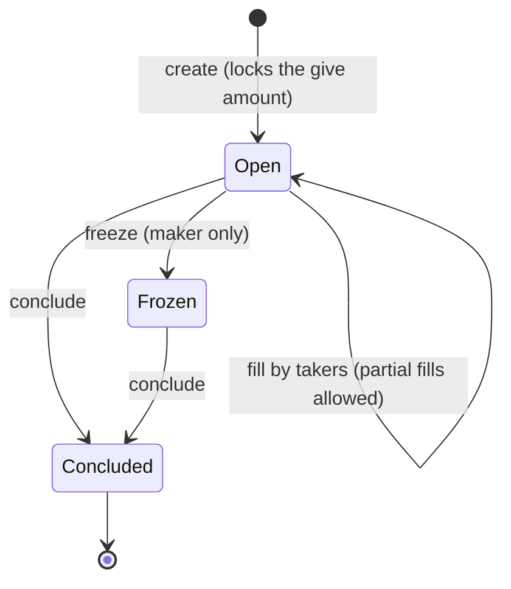

# Trading with Orders

The JavaScript path to Mintlayer's on-chain order trading with `@mintlayer/sdk`. The same workflow in Go lives in the [Go guides](../go/trading-with-orders.md); the wallet-cli version, with the order model (give/ask, conclude key, freeze semantics), is [Trading with orders](../cli/trading-with-orders.md).

An order locks a `give` amount on-chain and asks for an `ask` amount in return. Anyone may fill it (fully or partially); the maker can freeze it and conclude it to reclaim the remainder:



## Creating an order

```ts
const signedTx = await client.createOrder({
  give_token: 'tmltk1...',          // what you lock ('0' for the base coin)
  give_amount: 100,
  ask_token: 'tmltk2...',           // what you ask for in return
  ask_amount: 10,
  conclude_destination: 'tmt1q...', // where concluded leftovers return
});
```

## Discovering orders

```ts
const open = await client.getAvailableOrders(); // fillable on the network
const mine = await client.getAccountOrders();   // created by this account
```

Both return `OrderData` objects with the order's ask/give currencies, balances, and conclusion destination.

## Filling an order

```ts
const signedTx = await client.fillOrder({
  order_id: 'ord1...',
  amount: 5,               // how much of the ask you fulfill
  destination: 'tmt1q...', // where you receive your side
});
```

## Concluding an order

The order creator can close an order and reclaim the remaining balance:

```ts
const signedTx = await client.concludeOrder('ord1...');
```

## Example: market-maker loop

```ts
import { Client } from '@mintlayer/sdk';

const client = await Client.create({ network: 'testnet', autoRestore: true });
await client.connect();

// Watch the book and quote orders against your inventory
for (const order of await client.getAvailableOrders()) {
  // compare order.ask_balance / order.give_balance against your target price...
}

await client.createOrder({
  give_token: 'tmltk1...',
  give_amount: 100,
  ask_token: '0', // base coin
  ask_amount: 10,
  conclude_destination: client.getAddresses().receiving[0],
});
```

Every method above also exists as a `buildX` variant returning an unsigned transaction; see [Transactions](../../build/sdks/javascript/transactions.md#manual-building).
