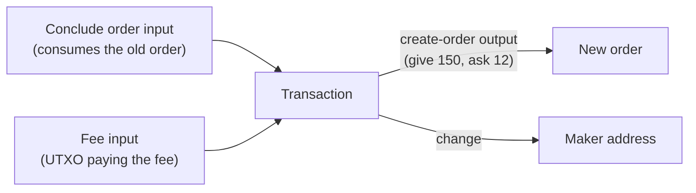

# Composing UTXOs: Updating an Order

Mintlayer is a UTXO chain: **there is no mutable state**. A DEX order is an unspent output, and every protocol object behaves the same way, so "updating" an order means spending it and re-creating it *in the same transaction*. This atomic spend-and-recreate pattern is the essence of UTXO composition.

This guide uses the low-level encoders from `@mintlayer/wasm-lib` (the same WebAssembly module the [JavaScript SDK](../../build/sdks/javascript/index.md) is built on), plus `MintlayerApiProvider` for reading chain state. The same workflow in Go and Python lives in the [Go](../go/utxo-composition.md) and [Python](../python/utxo-composition.md) guides.

## The pattern

A maker wants to update an existing order's conditions: lower the `ask` from 10 coins to 12 coins, raise the `give` from 100 tokens to 150 tokens. The transaction must contain:



All four effects happen atomically. If the transaction fails, the old order is untouched.

:::note[What consensus allows and forbids]

The pattern above is exactly what consensus permits: **one order operation input** (fill, conclude, or freeze; a slot shared with token account commands, so you cannot combine an order operation with a mint, an unmint, or any other command input) and **one `CreateOrder` output** per transaction. Concluding and re-creating in the same transaction sits precisely at both limits, which is what makes the atomic update work.

Everything past those limits is rejected by the verifier:

- A second command input (order operation or token account command): `MultipleAccountCommands`.
- A second `CreateOrder` output: `MultipleOrdersCreated`.
- Spending a `CreateOrder` output as a UTXO input: orders are not UTXOs; they are consumed only through order operation inputs (`InvalidInputTypeInTx`).
- Creating an order in a transaction with no UTXO input: the new order's id is derived from the first UTXO outpoint (`NoUtxoInputsForOrderIdCreation`), which is why the fee input below is not optional.

:::

## The ingredients

| Piece | Encoder | Source of truth |
| ----- | ------- | --------------- |
| Conclude input | `encode_input_for_conclude_order(orderId, nonce, currentBlockHeight, network)` | `nonce` from the indexer's order record |
| New order output | `encode_create_order_output(askAmount, askTokenId, giveAmount, giveTokenId, concludeAddress, network)` | the new conditions |
| Surplus / change outputs | `encode_output_transfer` (coins) / `encode_output_token_transfer` (tokens) | whatever is not re-locked |
| Fee input | `encode_input_for_utxo` with `encode_outpoint_source_id` | a coin UTXO you own |
| Witness for the conclude input | `encode_witness` with a `TxAdditionalInfo` | the order's balances |
| Witness for the coin input | `encode_witness` | the fee UTXO's output |
| New order id | `get_order_id(inputs, network)` | predicted from the inputs |

## Fetch the order state

```ts
import { MintlayerApiProvider } from '@mintlayer/sdk';

const api = new MintlayerApiProvider('http://127.0.0.1:3000', 'http://127.0.0.1:3000'); // the second URL is only used for batched queries

const oldOrderId = 'ord1...';  // the order to update
const order = await api.getOrder(oldOrderId);
const tip = await api.getChainTip();
console.log(`give: ${order.give_balance.atoms}  ask: ${order.ask_balance.atoms}  nonce: ${order.nonce}`);
```

Balances come back as `{atoms, decimal}` string pairs; always compose with atoms. `initially_asked` / `initially_given` capture what the maker originally promised; the sighash for the conclude input is bound to them, so keep them exactly as returned.

## Build the transaction

```ts
import initWasm, {
  Amount,
  encode_create_order_output,
  encode_input_for_conclude_order,
  encode_input_for_utxo,
  encode_outpoint_source_id,
  encode_output_transfer,
  encode_transaction,
  Network,
  SourceId,
} from '@mintlayer/wasm-lib';

await initWasm(); // required once, before any encoder call

const network = Network.Mainnet;
const concatBytes = (...parts: Uint8Array[]) => {
  const total = parts.reduce((n, p) => n + p.length, 0);
  const out = new Uint8Array(total);
  let offset = 0;
  for (const p of parts) {
    out.set(p, offset);
    offset += p.length;
  }
  return out;
};

// 1. Consume the old order
const concludeInput = encode_input_for_conclude_order(
  oldOrderId,
  BigInt(order.nonce),
  BigInt(tip.block_height) + 1n, // predicted inclusion height (tip + 1)
  network,
);

// 2. Fee payer: a coin UTXO you own
const feeTxIdBytes = Uint8Array.from(feeTxId.match(/.{2}/g)!.map((b) => parseInt(b, 16)));
const feeInput = encode_input_for_utxo(
  encode_outpoint_source_id(feeTxIdBytes, SourceId.Transaction),
  0,
);

// 3. Re-create the order with updated parameters
const newOrderOutput = encode_create_order_output(
  Amount.from_atoms('12000000000000'), // ask 12 coins
  null,                                // null token id = coin
  Amount.from_atoms('15000000000'),    // give 150 tokens
  giveTokenId,
  order.conclude_destination,          // where the concluded leftovers return
  network,
);

// 4. Any balance not re-locked returns via change outputs
const changeOutput = encode_output_transfer(
  Amount.from_atoms('2000000000'),
  makerAddr,
  network,
);

const tx = encode_transaction(
  concatBytes(concludeInput, feeInput),
  concatBytes(newOrderOutput, changeOutput),
  0n,
);
```

If the fee UTXO came from a token transfer instead of a coin transfer, the fee input still needs a **coin** UTXO: fees are always paid in the base coin. Keep a separate small coin UTXO for fees and use the change output to sweep back anything you do not want to re-lock.

## Sign it

The conclude input's sighash requires the order's balances via `TxAdditionalInfo`: this is the part that differs from a plain transfer. Signing is also where the inputs' backing UTXOs come in: `encode_witness` takes one entry per input, `0x00` for non-UTXO inputs (the conclude input) and `0x01` plus the encoded output for UTXO inputs (the fee input):

```ts
import {
  encode_witness,
  encode_signed_transaction,
  encode_output_transfer,
  make_private_key,
  SignatureHashType,
  type TxAdditionalInfo,
} from '@mintlayer/wasm-lib';

const makerKeyBytes = make_private_key(); // 32 random bytes, load yours instead
const feeOutput = encode_output_transfer(feeAmountAtoms, makerAddr, network); // re-encode the fee UTXO's output
const inputUtxos = concatBytes(new Uint8Array([0x00, 0x01]), feeOutput);

const additionalInfo: TxAdditionalInfo = {
  pool_info: {},
  order_info: {
    [oldOrderId]: {
      initially_asked: { coins: { atoms: order.initially_asked.atoms } },
      initially_given: { tokens: { token_id: giveTokenId, amount: { atoms: order.initially_given.atoms } } },
      ask_balance: { atoms: order.ask_balance.atoms },
      give_balance: { atoms: order.give_balance.atoms },
    },
  },
};

let witnessBytes = new Uint8Array();
for (let i = 0; i < 2; i++) { // one witness per input, in input order
  witnessBytes = concatBytes(
    witnessBytes,
    encode_witness(
      SignatureHashType.ALL,
      makerKeyBytes,
      makerAddr,
      tx,
      inputUtxos,
      i,
      additionalInfo,  // required for the conclude input
      BigInt(tip.block_height) + 1n,
      network,
    ),
  );
}

const signedTx = encode_signed_transaction(tx, witnessBytes);
```

## Submit and name the new order

```ts
import { get_order_id } from '@mintlayer/wasm-lib';

const txHex = Array.from(signedTx, (b) => b.toString(16).padStart(2, '0')).join('');
await api.broadcastTransaction(txHex);

const newOrderId = get_order_id(concatBytes(concludeInput, feeInput), network);
console.log('your updated order:', newOrderId);
```

`get_order_id` predicts the id the same way consensus derives it (from the first UTXO outpoint), so you can index the new order immediately.

## Variations

- **Cancel instead of update**: keep the conclude input and the fee input, drop the `CreateOrder` output, and transfer everything back. One order operation input, zero created orders, allowed.
- **Self-fill then re-quote**: fill your own order in one transaction (`FillOrder` input + `encode_witness_no_signature` for the witness of the order input) and conclude-and-recreate another; just never combine two order operations in the same transaction.
- **Chain delegations the same way**: the spend-and-recreate pattern applies to delegation outputs too; see [Staking with the wasm module](../go/staking.md#manual-transaction-building) for the Go twin.

For the higher-level wrappers around these encoders, see [Transactions](../../build/sdks/javascript/transactions.md#manual-building).
