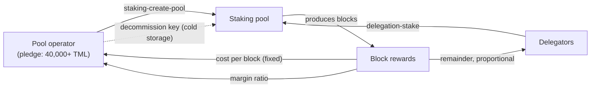

This guide walks through the full lifecycle of a Mintlayer staking pool, from initial setup through daily operation to decommissioning. It covers both the pool operator perspective and the delegation flow for users who want to stake without running a pool.

## Prerequisites

- A running, synced `node-daemon`
- `wallet-cli` connected to the node
- A wallet with at least 40,000 TML for the pledge (plus a small amount for transaction fees)

## Concepts

**Pool**: A staking entity created by an operator. It produces blocks on behalf of the network and earns rewards. The operator must pledge a minimum of 40,000 TML.

**Delegation**: A mechanism allowing other users (or the operator themselves) to contribute coins to a pool without giving the pool operator any authority over those coins. Delegators earn a share of rewards proportionally, minus the pool's cost per block and margin.

**Decommission key**: The key that can shut down a pool and reclaim the pledge. It is separate from the staking key and should be kept secure, ideally in cold storage.

The pool ecosystem and its reward split:



---

## Part 1: Setting Up a Pool

### Step 1: Prepare your decommission address

The decommission address controls the ability to shut down the pool and recover the pledge. It is strongly recommended to keep this key in cold storage, separate from the staking wallet.

If using a cold wallet, generate a receive address in the cold wallet and use that address here. The staking wallet only needs the address, not the key.

### Step 2: Create the pool

```
staking-create-pool <AMOUNT> <COST_PER_BLOCK> <MARGIN_RATIO> <DECOMMISSION_ADDRESS>
```

Example, a pool with 40,000 TML pledge, 1 TML fixed cost per block, 5% margin, cold decommission key:

```
staking-create-pool 40000 1 5% <decommission_address>
```

The wallet automatically generates a VRF key for the pool. You only need to supply one explicitly if the staking key belongs to a different wallet, see [Separation of Roles](#separation-of-roles) below.

**Reward parameters explained:**

- **Cost per block**: A fixed amount taken from each block reward and paid directly to the pool operator. Set to `0` if you prefer margin-only compensation.
- **Margin ratio**: After subtracting the cost per block, this percentage goes to the operator. The rest is split among delegators proportionally to their stake. Valid range is `0%` to `100%`.

After the transaction is confirmed, use `staking-list-pools` to find your pool id.

### Step 4: Verify the pool is visible

```
staking-list-pools
```

Note the pool id, you will need it in subsequent steps.

Check the pool's current balance:

```
staking-pool-balance <pool_id>
```

---

## Part 2: Starting Staking

### Start staking

Once the pool creation transaction is confirmed and the wallet is synced, start staking:

```
staking-start
```

Confirm it is active:

```
staking-status
```

### Auto-start staking on launch

To avoid having to manually run `staking-start` every time the wallet restarts, use the `--start-staking-for-account` flag when launching the wallet:

```
wallet-cli mainnet --start-staking-for-account 0
```

Replace `0` with your account index if you are using a non-default account. This is the recommended setup for unattended staking nodes.

### Monitor block production

To see which blocks your pool has created:

```
staking-list-created-block-ids
```

---

## Part 3: Delegating to Your Own Pool (Optional but Recommended)

Staking rewards earned by the pool's pledge **cannot be withdrawn without decommissioning the pool**. To access accumulated rewards without shutting down the pool, create a delegation to your own pool. Delegation balances can be withdrawn at any time (subject to a lock period).

### Step 1: Create a delegation

```
delegation-create <owner_address> <pool_id>
```

The owner address is the address whose key authorizes withdrawals from the delegation. Use an address from the current wallet (or cold wallet for extra security).

### Step 2: Fund the delegation

```
delegation-stake <amount> <delegation_id>
```

Use `delegation-list-ids` to see the delegation id returned from the previous step:

```
delegation-list-ids
```

### Step 3: Withdraw delegation rewards

To withdraw a specific amount:

```
delegation-withdraw <destination_address> <amount> <delegation_id>
```

To withdraw the entire delegation balance in one operation:

```
staking-sweep-delegation <destination_address> <delegation_id>
```

Note: withdrawn coins are subject to a lock period before they become spendable.

---

## Part 4: Managing the Pool Over Time

### Stop and restart staking

```
staking-stop
staking-start
```

Stopping staking does not affect the pool or delegations, it simply pauses block production by this wallet.

### Check pool balance

```
staking-pool-balance <pool_id>
```

### List delegation ids and balances

```
delegation-list-ids
```

---

## Part 5: Decommissioning the Pool

Decommissioning permanently shuts down the pool and returns the pledge (plus all accumulated staking rewards) to a specified address. This cannot be undone.

### Case A: Decommission key is in the current wallet

```
staking-decommission-pool <pool_id> <output_address>
```

### Case B: Decommission key is in a cold wallet

1. In the hot wallet, create an unsigned decommission request:

   ```
   staking-decommission-pool-request <pool_id> <output_address>
   ```

2. Copy the returned hex string to the cold wallet.

3. In the cold wallet, sign the transaction:

   ```
   account-sign-raw-transaction <hex>
   ```

4. Back in the hot wallet (or any connected wallet), broadcast the signed transaction:

   ```
   node-submit-transaction <signed_hex>
   ```

After the transaction is confirmed, the pool is decommissioned and the funds are released to `<output_address>`.

---

## Separation of Roles

For a production setup, consider separating concerns across wallets:

| Role | Key type | Recommended storage |
|---|---|---|
| Block signing (staking key) | Hot (must be online) | Hot wallet on the staking server |
| Decommission | Cold (used rarely) | Cold wallet or hardware wallet |
| Delegation withdrawal | Medium (used periodically) | Separate wallet or cold wallet |

To create a pool where the staking key belongs to a different wallet than the one doing the setup, supply the staker address and VRF key explicitly:

```
staking-create-pool <amount> <cost_per_block> <margin> <decommission_address> <staker_public_key_address> <vrf_public_key>
```

The staker address must be a public key address (not a public key hash address). Use `address-reveal-public-key-as-address` to convert an address from the staking wallet.

---

## Quick Reference

| Task | Command |
|---|---|
| Create pool | `staking-create-pool <amount> <cost> <margin> <decommission_address>` |
| Generate VRF key (optional) | `staking-new-vrf-public-key` |
| List your pools | `staking-list-pools` |
| Pool balance | `staking-pool-balance <pool_id>` |
| Start staking | `staking-start` |
| Stop staking | `staking-stop` |
| Check staking status | `staking-status` |
| Created block ids | `staking-list-created-block-ids` |
| Create delegation | `delegation-create <owner> <pool_id>` |
| Fund delegation | `delegation-stake <amount> <delegation_id>` |
| List delegations | `delegation-list-ids` |
| Withdraw delegation | `delegation-withdraw <address> <amount> <delegation_id>` |
| Sweep delegation | `staking-sweep-delegation <address> <delegation_id>` |
| Decommission (hot key) | `staking-decommission-pool <pool_id> <output_address>` |
| Decommission request (cold key) | `staking-decommission-pool-request <pool_id> <output_address>` |

---

## Related Pages

- Staking Overview
- [`staking-create-pool`](../wallet/cli/commands/staking/staking-create-pool-command-guide.md)
- [`staking-decommission-pool`](../wallet/cli/commands/staking/staking-decommission-pool-command-guide.md)
- [`staking-decommission-pool-request`](../wallet/cli/commands/staking/staking-decommission-pool-request-command-guide.md)
- [`delegation-create`](../wallet/cli/commands/staking/delegation-create-command-guide.md)
- [`delegation-stake`](../wallet/cli/commands/staking/delegation-stake-command-guide.md)
- [`delegation-withdraw`](../wallet/cli/commands/staking/delegation-withdraw-command-guide.md)
- [`staking-sweep-delegation`](../wallet/cli/commands/staking/staking-sweep-delegation-command-guide.md)
- [Wallet CLI Options](../wallet/cli/index.md)
