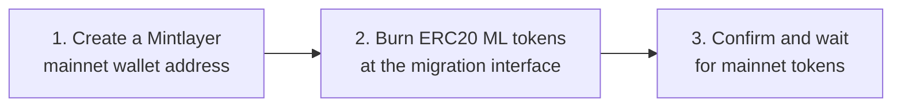

This guide will walk you through the process of migrating your ML tokens from the Ethereum/ERC20 network to the Mintlayer network. Please read each step carefully, as this process is irreversible and out of our control.

## Important Disclaimers

- **Security**: It is highly recommended to use a clean system to generate your Mintlayer address.
- **Irreversible Process**: Once your ML tokens are burned on the Ethereum network, the action cannot be undone.
- **Responsibility**: You are solely responsible for this migration, so make sure to double-check all details and follow the instructions carefully.

## Pre-requisites

1. Access to your ERC20 ML tokens.
2. `wallet-cli` [installed](../getting-started/install/install-from-binaries.md) on your system.

The migration has three steps:



## Step 1: Generate a Mintlayer Mainnet Wallet Address

1. Open a terminal window and create a new wallet:

```
wallet-cli mainnet
```

2. Once inside the wallet REPL, create a new wallet file:

```
wallet-create software /path/to/my-wallet.dat store-seed-phrase
```

3. The wallet will display your seed phrase. **Write it down and keep it safe, this is the only way to recover your funds.**

4. Generate a receive address:

```
address-new
```

The output will be your Mintlayer mainnet address. It will look like:

```
mtc1qyy6ggpq966pxrgdeq3ak2zza3hxrezgpycv6nm0
```

Mintlayer mainnet addresses start with `mtc1`. Testnet addresses start with `tmt1`.

## Step 2: Burn ERC20 ML Tokens

1. Go to the [Mintlayer Token Migration Interface](https://token.mintlayer.org/migration) to burn your ERC20 ML tokens.
2. Specify the destination address (the Mintlayer mainnet address generated in Step 1).

## Step 3: Confirm and Wait

After burning the ERC20 tokens, they will be available on the Mintlayer mainnet at the specified address.

**Note**: You can repeat the process as many times as you want with as many addresses as you want.

Thank you for following this guide. If you have any issues or questions, feel free to reach out for support.
