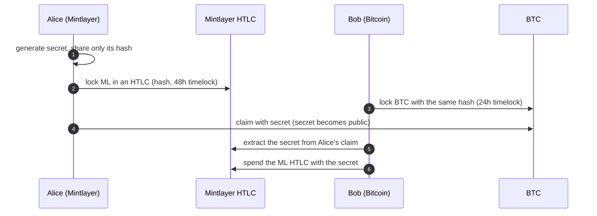

# Atomic Swap

The Python path to cross-chain atomic swaps. The same workflow exists for the [command line](../cli/atomic-swap-with-bitcoin.md) (the full protocol: roles, the secret/hash flow, and [timelock planning](../cli/atomic-swap-with-bitcoin.md#timelock-planning)), [Go](../go/atomic-swap.md), [JavaScript](../javascript/atomic-swap.md), and [Rust](../rust/atomic-swap.md). This page shows how to build the **Mintlayer side** with the `wasm` module.



If a party stalls, the HTLC's refund path returns the funds once the timelock expires.

## Locking funds in an HTLC

```python
from mintlayer.wasm import (
    Amount,
    Network,
    SIGHASH_ALL,
    SOURCE_TRANSACTION,
    TxAdditionalInfo,
)
from mintlayer.wasm import Client as WasmClient

c = WasmClient()

src_id = c.encode_outpoint_source_id(tx_id_bytes, SOURCE_TRANSACTION)
htlc_input = c.encode_input_for_utxo(src_id, output_index)

htlc_output = c.encode_output_htlc(
    Amount(atoms="100000000000"),  # 1 ML
    None,                          # token_id: None for the base coin
    secret_hash,                   # only the hash is shared
    "mtc1q_spend...",              # where a successful claim pays out
    "mtc1q_refund...",             # where a refund returns
    refund_timelock,               # encoded timelock
    Network.MAINNET,
)
```

Assemble the transaction with the regular input/output encoders and submit; see [Building transactions](../../build/sdks/python/transactions.md).

## Claiming and refunding

The claim embeds the preimage in the witness; the refund path is available after the timelock:

```python
# Spend (claim) the HTLC, revealing the secret
witness = c.encode_witness_htlc_spend(
    SIGHASH_ALL,
    private_key,
    input_owner_dest,
    transaction,
    input_utxos,
    input_index,
    secret,
    TxAdditionalInfo(),
    block_height,
    Network.MAINNET,
)

# Refund after the timelock with a single-signature refund address
witness = c.encode_witness_htlc_refund_single_sig(
    SIGHASH_ALL,
    private_key,
    input_owner_dest,
    transaction,
    input_utxos,
    input_index,
    TxAdditionalInfo(),
    block_height,
    Network.MAINNET,
)
```

## Learning the counterparty's secret

When the counterparty claims their HTLC, the secret is revealed on-chain. Extract it from the signed claim transaction:

```python
secret = c.extract_htlc_secret(
    signed_tx,
    htlc_outpoint_source_id,
    htlc_output_index,
)
```

## Checklist

- Agree off-chain on amounts, rate, and **timelock durations** before locking anything.
- Bitcoin timelock strictly shorter than the Mintlayer timelock.
- Only the hash is shared; the secret is revealed by the first claim.
- Verify the on-chain HTLC (amount, addresses, timelock) before locking the other side.
