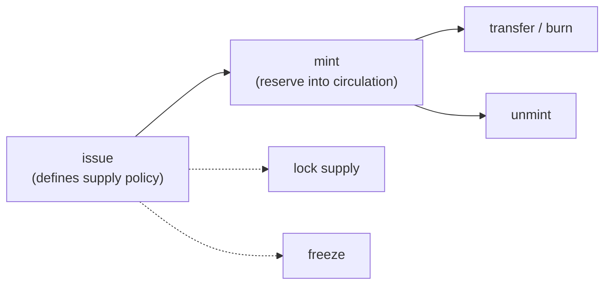

# Issue a Token

This guide covers the full MLS-01 token lifecycle in Python: issuing, minting, transferring, and managing supply and authority. The same workflow exists for the [command line](../cli/issue-new-token.md) (which explains the underlying concepts: token id, authority address, reserve vs circulating supply), [Go](../go/issue-token.md), [JavaScript](../javascript/issue-token.md), and [Rust](../rust/issue-token.md).

Prerequisites: a funded wallet and a running `wallet-rpc-daemon` plus indexer (see [Developer Setup](../../build/development.md) for ports and authentication).



## Issuing

```python
from mintlayer.wallet import Client, IssueTokenParams, TokenMetadata, TokenSupply

wc = Client("http://127.0.0.1:3034")

authority_addr = wc.new_address(0)

result = wc.issue_token(
    IssueTokenParams(
        account=0,
        destination_address=authority_addr,
        metadata=TokenMetadata(
            token_ticker="MYTOKEN",
            number_of_decimals=8,
            metadata_uri="https://example.com/mytoken.json",
            token_supply=TokenSupply(type="Lockable"),
            is_freezable=False,
        ),
    )
)
print(f"token id: {result.token_id}  tx: {result.tx_id}")
```

Supply policies: `TokenSupply(type="Lockable")` (unlimited minting until locked), `"Unlimited"`, or `"Fixed"` with a supply amount for a hard cap. The destination address becomes the **token authority**: the key that controls future operations (minting, freezing, authority transfer). Keep it secure.

## Metadata

Publish metadata at the metadata URI following the [Token Metadata Standards](../../reference/token-standards/mls01.md) (MLS-01 schema) so wallets and explorers can render your token. The URI can be updated later by the authority.

## Minting and unminting

Wait for the issuance transaction to confirm before minting. Minting moves tokens from the reserve into circulation; unminting reverses it.

```python
from mintlayer.wallet import Amount, MintParams, UnmintParams

mint_result = wc.mint_tokens(
    MintParams(
        account=0,
        token_id=result.token_id,
        address=recipient_addr,
        amount=Amount(atoms="100000"),  # in smallest token units
    )
)

wc.unmint_tokens(
    UnmintParams(
        account=0,
        token_id=result.token_id,
        amount=Amount(atoms="50000"),
    )
)
```

## Transferring and burning

```python
from mintlayer.wallet import TokenSendParams

wc.send_token(
    TokenSendParams(
        account=0,
        token_id=result.token_id,
        address=recipient_addr,
        amount=Amount(atoms="10000"),
    )
)
```

## Authority, freeze, and supply lock

All management operations require the token authority key:

```python
from mintlayer.wallet import ChangeAuthorityParams, FreezeParams, LockSupplyParams, UnfreezeParams

# Irreversible: fixes the supply at the current circulating amount.
# Note the field is account_index, not account.
wc.lock_token_supply(LockSupplyParams(account_index=0, token_id=result.token_id))

wc.freeze_token(FreezeParams(account=0, token_id=result.token_id, is_unfreezable=True))
wc.unfreeze_token(UnfreezeParams(account=0, token_id=result.token_id))
wc.change_token_authority(
    ChangeAuthorityParams(account=0, token_id=result.token_id, address=new_authority_addr)
)
```

## Reading token state

```python
from mintlayer.indexer import Client as IndexerClient

idx = IndexerClient("http://127.0.0.1:3000")

token = idx.get_token(result.token_id)
print(f"ticker: {token.token_ticker}  circulating: {token.circulating_supply.decimal}")
```

## Manual transaction building

For full custody without the wallet daemon, the `wasm` module encodes issuance, mint, and freeze inputs/outputs directly and exposes the protocol fee functions (`fungible_token_issuance_fee`, `token_supply_change_fee`, `token_freeze_fee`, `token_change_authority_fee`). See [Tokens and NFTs](../../build/sdks/python/tokens.md#building-token-transactions-manually) and [Forging custom transactions](custom-transactions.md).
