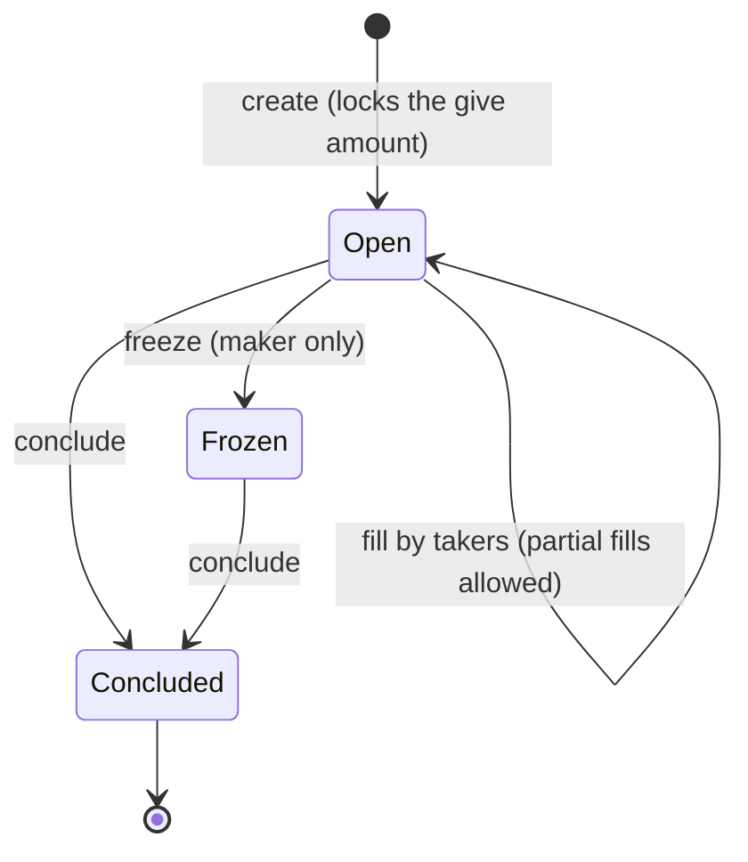

# Trading with Orders

The Python path to Mintlayer's on-chain order trading. The same workflow exists for the [command line](../cli/trading-with-orders.md) (the order model: give/ask, conclude key, freeze semantics), [Go](../go/trading-with-orders.md), [JavaScript](../javascript/trading-with-orders.md), and [Rust](../rust/trading-with-orders.md).

An order locks a `give` amount on-chain and asks for an `ask` amount in return. Anyone may fill it (fully or partially); the maker can freeze it and conclude it to reclaim the remainder:



## Creating an order

```python
from mintlayer.wallet import Amount, CreateOrderParams, OutputValue

created = wc.create_order(
    CreateOrderParams(
        account=0,
        ask=OutputValue.coins("1000000000000"),              # 1 ML asked
        give=OutputValue.tokens(token_id, "500000"),         # tokens given
        conclude_address="mtc1q_conclude...",
    )
)
```

## Discovering orders

```python
own = wc.list_own_orders(0)

active = wc.list_all_active_orders(...)  # optional currency filters
```

The indexer provides the same listings read-only: `idx.list_orders(...)`, `idx.list_orders_by_pair(...)`, `idx.get_order(...)`; the node exposes `order_info` and `orders_info_by_currencies`.

## Filling an order

The fill amount is denominated in the **ask** currency:

```python
from mintlayer.wallet import Amount, FillOrderParams

wc.fill_order(
    FillOrderParams(
        account=0,
        order_id="mordr1...",
        fill_amount_in_ask_currency=Amount(atoms="100000"),
        output_address="mtc1q_destination...",
    )
)
```

## Concluding and freezing (maker)

```python
from mintlayer.wallet import ConcludeOrderParams, FreezeOrderParams

wc.conclude_order(ConcludeOrderParams(account=0, order_id="mordr1..."))
wc.freeze_order(FreezeOrderParams(account=0, order_id="mordr1..."))
```

Concluding returns the unclaimed `give` remainder plus any accumulated `ask` balance to the order's conclude destination. Only the maker can freeze or conclude.

## Manual flows

With the `wasm` module, `encode_create_order_output` builds the order output and `get_order_id` predicts the id from the inputs; fills use `encode_input_for_fill_order`, whose inputs must **not** be signed (`encode_witness_no_signature`). To **update** an existing order (new price or amounts), compose a transaction that consumes the conclude-order input and re-creates the order: see [Composing UTXOs](utxo-composition.md). See [Tokens and NFTs](../../build/sdks/python/tokens.md) in the SDK reference for the encoders.
