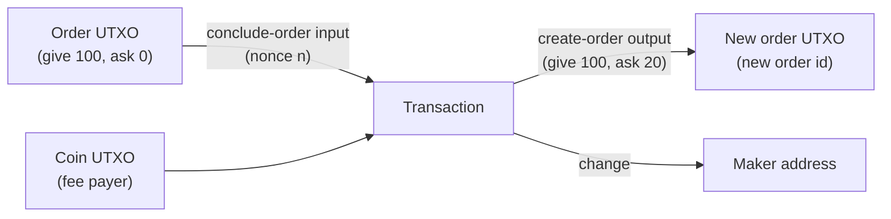

# Composing UTXOs: Updating an Order

Mintlayer is a UTXO chain: **there is no mutable state**. A DEX order is an unspent output, and every protocol object behaves the same way, so "updating" an order means spending it and re-creating it *in the same transaction*. This atomic spend-and-recreate pattern is the essence of UTXO composition.

## The pattern

An order lives as a `CreateOrder` output holding the `give` balance plus any accumulated `ask` balance. Its spend authority is the maker, gated by the order's **nonce**. To update the order (new price, new amounts), build one transaction that:

1. consumes the order via a **conclude-order input** (this releases the whole order balance), and
2. re-locks the funds into a fresh **create-order output** with the new parameters.



Two consequences worth internalizing:

- The **new order gets a new ID** (IDs are derived from inputs; see [predicting IDs](custom-transactions.md#predicting-ids)). Publish the new ID and retire the old one.
- If the transaction fails or is dropped, nothing changed: the old order is still live and its nonce unspent.

## The ingredients

| Piece | Encoder | Source of truth |
| ----- | ------- | --------------- |
| Conclude input | `encode_input_for_conclude_order(order_id, nonce, current_block_height, network)` | `nonce` from the indexer's order record |
| New order output | `encode_create_order_output(ask_amount, ask_token_id, give_amount, give_token_id, conclude_address, network)` | Your new price/amounts |
| Surplus / change outputs | `encode_output_transfer` / `encode_output_token_transfer` | Old balance minus new give amount |
| Fee input | `encode_input_for_utxo` | A coin UTXO you own |
| Witness for the conclude input | `encode_witness` with `TxAdditionalInfo` | Order balances from the indexer |
| Witness for the coin input | `encode_witness` | n/a |

## Fetch the order state

```python
from mintlayer.indexer import Client

idx = Client("http://127.0.0.1:3000")

order = idx.get_order(old_order_id)
print(f"give: {order.give_balance.atoms}  ask: {order.ask_balance.atoms}  nonce: {order.nonce}")
```

The `ask_balance` matters: any asks accumulated from takers are part of the order you are concluding, so the new order (or a change output) must account for them.

## Build the transaction

Example: top up the `give` side and raise the ask. Old order: give 100 tokens / ask 10 coins. New order: give 150 / ask 12. The conclude releases 100 tokens plus accumulated asks; a separate token UTXO adds the extra 50.

```python
# 1. Consume the old order
conclude_input = c.encode_input_for_conclude_order(
    old_order_id, order.nonce, tip.block_height, Network.MAINNET
)

# 2. Fee payer
src_id = c.encode_outpoint_source_id(fee_txid_bytes, SOURCE_TRANSACTION)
fee_input = c.encode_input_for_utxo(src_id, 0)

# 3. Re-create the order with updated parameters
new_order_output = c.encode_create_order_output(
    Amount(atoms="12"), None,            # ask 12 coins (None token id = coin)
    Amount(atoms="150"), give_token_id,  # give 150 tokens
    conclude_address,                    # same conclude destination
    Network.MAINNET,
)

# 4. Any balance not re-locked returns via change outputs
change_output = c.encode_output_transfer(
    Amount(atoms="2000000000"), maker_addr, Network.MAINNET  # fee change
)

tx = c.encode_transaction(conclude_input + fee_input, new_order_output + change_output, 0)
```

Token inputs (e.g. a UTXO holding the additional 50 tokens) encode with `encode_input_for_utxo` like any other spend; only the *outputs* distinguish coin from token value.

## Sign it

The conclude input's sighash requires the order's balances via `TxAdditionalInfo`; this is the part that differs from a plain transfer:

```python
from mintlayer.wasm import OrderBalance, OrderInfo, SimpleCurrencyAmount, TxAdditionalInfo

additional_info = TxAdditionalInfo(
    order_info={
        old_order_id: OrderInfo(
            initially_asked=SimpleCurrencyAmount.coins(order.initially_asked.atoms),
            initially_given=SimpleCurrencyAmount.tokens(
                give_token_id, order.initially_given.atoms
            ),
            ask_balance=OrderBalance(atoms=order.ask_balance.atoms),
            give_balance=OrderBalance(atoms=order.give_balance.atoms, token_id=give_token_id),
        )
    }
)

witness_bytes = b""
for i in range(2):  # one witness per input, in input order
    witness_bytes += c.encode_witness(
        SIGHASH_ALL,
        maker_key,
        maker_addr,
        tx,
        input_utxos,
        i,
        additional_info,     # required for the order input
        tip.block_height,
        Network.MAINNET,
    )

signed_tx = c.encode_signed_transaction(tx, witness_bytes)
```

Submit via the indexer or node as usual, then predict and store the new order ID:

```python
new_order_id = c.get_order_id(conclude_input + fee_input, Network.MAINNET)
```

## Variations of the same pattern

The conclude-then-recreate transaction is one instance of a general tool. With the same encoders you can:

- **Cancel an order**: conclude input, no create-order output; the balance flows to change outputs.
- **Self-fill and requote**: conclude input + `FillOrder`-style split: partially fill your own order and re-create a smaller one. (A pure fill by a taker uses `encode_input_for_fill_order` and needs **no signature** for that input: `encode_witness_no_signature`.)
- **Freeze before restructuring**: `encode_input_for_freeze_order` stops takers while you prepare the replacement transaction.
- **Chain protocol objects**: the same spend-and-recreate logic composes delegations (withdraw input + `encode_output_delegate_staking` output) and any future output type.

:::note

Exactly which balances must be re-assigned to which outputs is enforced by consensus, not by the encoders: the runtime tells you *if* a transaction is invalid, the indexer tells you *what* the balances are, and the composition is yours to design.

:::

For the order model itself (give/ask, conclude key, freeze semantics), see [Trading with Orders](trading-with-orders.md) and the wallet-cli guide [Trading with orders](../cli/trading-with-orders.md).
