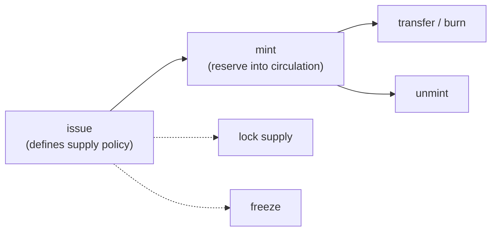

# Issue a Token

This guide covers the full MLS-01 token lifecycle in Rust: issuing, minting, transferring, and managing supply and authority. The same workflow exists for the [command line](../cli/issue-new-token.md) (which explains the underlying concepts: token id, authority address, reserve vs circulating supply), [Go](../go/issue-token.md), and [JavaScript](../javascript/issue-token.md).



## Issuing via the wallet daemon

```rust
use mintlayer_sdk::wallet::{self, IssueTokenParams, TokenMetadata, TokenSupply, TxOptions};

let c = wallet::Client::new("http://127.0.0.1:3034");
let authority = c.new_address(0).await?;

let issue = c.issue_token(IssueTokenParams {
    account: 0,
    destination_address: authority.clone(), // becomes the token authority
    metadata: TokenMetadata {
        token_ticker: "MYTOKEN".into(),
        number_of_decimals: 2,
        metadata_uri: "https://example.com/token".into(),
        token_supply: TokenSupply::Lockable,
        is_freezable: false,
    },
    options: TxOptions::default(),
}).await?;
println!("token id: {} (tx {})", issue.token_id, issue.tx_id);
```

Supply policies: `TokenSupply::Lockable` (unlimited minting until locked), `TokenSupply::Unlimited`, or `TokenSupply::Fixed(Amount)` for a hard cap. The destination address becomes the **token authority**: the key that controls all later token operations. Keep it secure.

## Metadata

Publish metadata at the metadata URI following the [Token Metadata Standards](../../reference/token-standards/mls01.md) (MLS-01 schema) so wallets and explorers can render your token. The URI can be updated later by the authority.

## Minting, unminting and supply locking

Wait for the issuance transaction to confirm before minting.

```rust
use mintlayer_sdk::wallet::{Amount, MintParams, TxOptions, UnmintParams};

c.mint_tokens(MintParams {
    account: 0,
    token_id: issue.token_id.clone(),
    address: "mtc1q_recipient...".into(),
    amount: Amount::from_atoms(100_000),
    options: TxOptions::default(),
}).await?;

// Removes tokens from circulation (the tx burns them).
c.unmint_tokens(UnmintParams {
    account: 0,
    token_id: issue.token_id.clone(),
    amount: Amount::from_atoms(50_000),
    options: TxOptions::default(),
}).await?;

// Irreversible: fixes the supply at the current circulating amount.
// Note the field is account_index, not account.
c.lock_token_supply(wallet::LockSupplyParams {
    account_index: 0,
    token_id: issue.token_id.clone(),
    options: TxOptions::default(),
}).await?;
```

## Freezing and authority change

```rust
use mintlayer_sdk::wallet::{FreezeParams, TxOptions, UnfreezeParams};

// is_unfreezable: true means the authority can unfreeze later.
c.freeze_token(FreezeParams {
    account: 0, token_id: issue.token_id.clone(),
    is_unfreezable: true, options: TxOptions::default(),
}).await?;

c.unfreeze_token(UnfreezeParams {
    account: 0, token_id: issue.token_id.clone(), options: TxOptions::default(),
}).await?;

c.change_token_authority(wallet::ChangeAuthorityParams {
    account: 0,
    token_id: issue.token_id.clone(),
    address: "mtc1q_new_authority...".into(),
    options: TxOptions::default(),
}).await?;
```

## Reading token state

```rust
use mintlayer_sdk::indexer::{Client, PageOpts};

let idx = Client::new("http://127.0.0.1:3000");
let token = idx.token(&issue.token_id).await?;
println!("ticker {} supply {} locked {}", token.token_ticker,
    token.circulating_supply.decimal, token.is_locked);
let txs = idx.token_transactions(&issue.token_id, PageOpts::default()).await?;
```

## Full-custody issuance

Without the wallet daemon, build the issuance output with the `crypto` module and pair it with a coin input covering the issuance fee. `get_token_id` predicts the token id from the inputs; parameters are validated against the chain config. See [Tokens and NFTs](../../build/sdks/rust/tokens.md#issuing-via-the-crypto-module) in the SDK reference for the complete flow including minting via nonce inputs.
