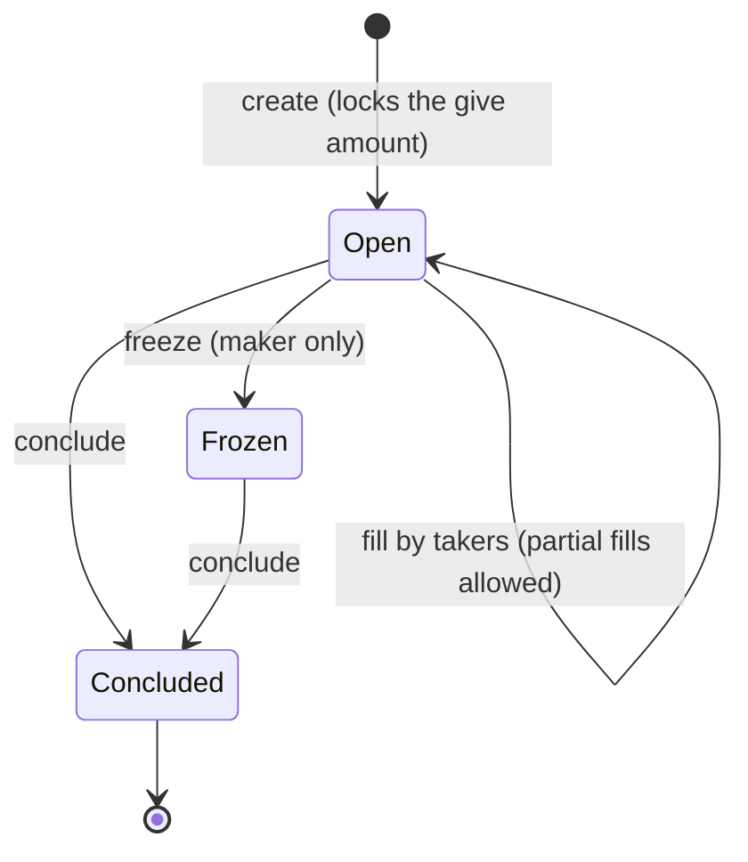

# Trading with Orders

The Rust path to Mintlayer's on-chain order trading. The same workflow exists for the [command line](../cli/trading-with-orders.md) (the order model: give/ask, conclude key, freeze semantics), [Go](../go/trading-with-orders.md), and [JavaScript](../javascript/trading-with-orders.md).

An order locks a `give` amount on-chain and asks for an `ask` amount in return. Anyone may fill it (fully or partially); the maker can freeze it and conclude it to reclaim the remainder:



## Creating an order

```rust
use mintlayer_sdk::wallet::{Amount, CreateOrderParams, TxOptions};

let created = c.create_order(CreateOrderParams {
    account: 0,
    ask_amount: Amount::from_atoms(1_000_000_000_000), // 1 ML asked
    ask_currency: None,                                 // None = coin
    give_amount: Amount::from_atoms(500_000),
    give_currency: Some(token_id.clone()),              // token given
    conclude_address: "mtc1q_conclude...".into(),
    options: TxOptions::default(),
}).await?;
```

## Discovering orders

```rust
// Your own orders:
let own = c.list_own_orders(0).await?;

// Everything active, optionally filtered by currency:
use mintlayer_sdk::wallet::{ListOrdersParams, Currency};
let active = c.list_all_active_orders(ListOrdersParams {
    ask_currency: None,
    give_currency: None,
}).await?;
```

The indexer provides the same listings read-only: `idx.list_orders(...)`, `idx.list_orders_by_pair(...)`, `idx.order(...)`; the node exposes `order_info` and `orders_info_by_currencies` (the `nonce` field is `Option<u64>`: `None` while the order has no account spending history).

## Filling an order

The fill amount is denominated in the **ask** currency:

```rust
use mintlayer_sdk::wallet::{Amount, FillOrderParams, TxOptions};

c.fill_order(FillOrderParams {
    account: 0,
    order_id: "mordr1...".into(),
    amount: Amount::from_atoms(100_000), // in the ask currency
    destination: Some("mtc1q_destination...".into()),
    options: TxOptions::default(),
}).await?;
```

## Concluding and freezing (maker)

```rust
use mintlayer_sdk::wallet::{ConcludeOrderParams, FreezeOrderParams, TxOptions};

c.conclude_order(ConcludeOrderParams {
    account: 0,
    order_id: "mordr1...".into(),
    options: TxOptions::default(),
}).await?;

c.freeze_order(FreezeOrderParams {
    account: 0,
    order_id: "mordr1...".into(),
    options: TxOptions::default(),
}).await?;
```

Concluding returns the unclaimed `give` remainder plus any accumulated `ask` balance to the order's conclude destination. Only the maker can freeze or conclude.

## Manual flows

With the `crypto` feature, `encode_create_order_output` builds the order output and `get_order_id` predicts the id from the inputs; fills use `encode_input_for_fill_order`, whose inputs must **not** be signed (`encode_witness_no_signature`). Before the orders V1 fork the fill's `nonce` and `destination` parameters are significant; after the fork both are ignored, and `encode_input_for_freeze_order` requires orders V1 (`crypto::Error::OrdersV1NotActivated` before it). See [Tokens and NFTs](../../build/sdks/rust/tokens.md#dex-orders) in the SDK reference.
