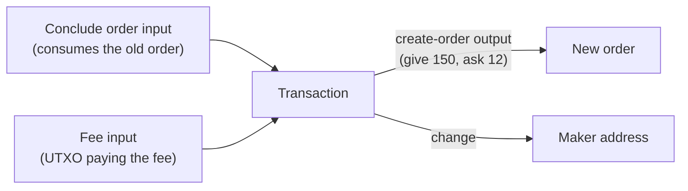

# Composing UTXOs: Updating an Order

Mintlayer is a UTXO chain: **there is no mutable state**. A DEX order is an unspent output, and every protocol object behaves the same way, so "updating" an order means spending it and re-creating it *in the same transaction*. This atomic spend-and-recreate pattern is the essence of UTXO composition.

This guide uses the [crypto module](../../build/sdks/rust/crypto.md) of the Rust SDK and its indexer client. The same workflow in Go, JavaScript, and Python lives in the [Go](../go/utxo-composition.md), [JavaScript](../javascript/utxo-composition.md), and [Python](../python/utxo-composition.md) guides.

:::note[Requires an unreleased SDK]

The order-signing re-exports used below (`OrderAdditionalInfo`, `OrderId`, `TokenId`, and the public `parse_addressable`) ship in the next SDK release after v0.1.0 ([mintlayer/rust-sdk#5](https://github.com/mintlayer/rust-sdk/pull/5), unreleased at the time of writing).

:::

## The pattern

A maker wants to update an existing order's conditions: lower the `ask` from 10 coins to 12 coins, raise the `give` from 100 tokens to 150 tokens. The transaction must contain:



All four effects happen atomically. If the transaction fails, the old order is untouched.

:::note[What consensus allows and forbids]

The pattern above is exactly what consensus permits: **one order operation input** (fill, conclude, or freeze; a slot shared with token account commands, so you cannot combine an order operation with a mint, an unmint, or any other command input) and **one `CreateOrder` output** per transaction. Concluding and re-creating in the same transaction sits precisely at both limits, which is what makes the atomic update work.

Everything past those limits is rejected by the verifier:

- A second command input (order operation or token account command): `MultipleAccountCommands`.
- A second `CreateOrder` output: `MultipleOrdersCreated`.
- Spending a `CreateOrder` output as a UTXO input: orders are not UTXOs; they are consumed only through order operation inputs (`InvalidInputTypeInTx`).
- Creating an order in a transaction with no UTXO input: the new order's id is derived from the first UTXO outpoint (`NoUtxoInputsForOrderIdCreation`), which is why the fee input below is not optional.

:::

## The ingredients

| Piece | Call | Source of truth |
| ----- | ---- | --------------- |
| Conclude input | `encode_input_for_conclude_order(order_id, nonce, current_block_height, network)` | `nonce` from the indexer's order record |
| New order output | `encode_create_order_output(ask_amount, ask_token_id, give_amount, give_token_id, conclude_address, network)` | the new conditions |
| Surplus / change outputs | `encode_output_transfer` (coins) / `encode_output_token_transfer` (tokens) | whatever is not re-locked |
| Fee input | `encode_input_for_utxo` with `encode_outpoint_source_id` | a coin UTXO you own |
| Witness for the conclude input | `encode_witness` with a `TxAdditionalInfo` | the order's balances |
| Witness for the coin input | `encode_witness` | the fee UTXO's output |
| New order id | `get_order_id(&inputs, network)` | predicted from the inputs |

## Fetch the order state

```rust
use mintlayer_sdk::indexer;

let indexer = indexer::Client::new("http://127.0.0.1:3000");
let network = Network::Testnet;

let order = indexer.order(OLD_ORDER_ID).await?;
let tip = indexer.tip().await?;
println!(
    "give: {}  ask: {}  nonce: {}",
    order.give_balance.atoms, order.ask_balance.atoms, order.nonce.0
);

// Predicted inclusion height: the next block after the current tip.
let inclusion_height = tip.block_height.checked_add(1).expect("height overflow");
```

Balances come back as `Amount`, an atom count (u128) plus a `decimal` string; always compose with atoms. `initially_asked` / `initially_given` capture what the maker originally promised; the sighash for the conclude input is bound to them, so keep them exactly as returned.

## Build the transaction

```rust
use mintlayer_sdk::crypto::{
    self,
    types::{H256, TokenId},
    Amount, SourceId,
};

// 1. Consume the old order
let conclude_input = crypto::encode_input_for_conclude_order(
    OLD_ORDER_ID,
    order.nonce.0,
    inclusion_height,
    network,
)?;

// 2. Fee payer: a coin UTXO you own
let fee_tx_id = H256::from_slice(&hex::decode(FEE_TX_ID_HEX)?);
let fee_input = crypto::encode_input_for_utxo(
    crypto::encode_outpoint_source_id(fee_tx_id, SourceId::Transaction),
    0,
);

// 3. Re-create the order with updated parameters
let give_token_id: TokenId = crypto::parse_addressable(network, GIVE_TOKEN_ID)?;
let new_order_output = crypto::encode_create_order_output(
    Amount::from_atoms(12_000_000_000_000), // ask 12 coins
    None,                                   // None = coin
    Amount::from_atoms(15_000_000_000),     // give 150 tokens
    Some(GIVE_TOKEN_ID),
    &order.conclude_destination,
    network,
)?;

// 4. Any balance not re-locked returns via change outputs
let change_output =
    crypto::encode_output_transfer(Amount::from_atoms(2_000_000_000), MAKER, network)?;

let inputs = vec![conclude_input.clone(), fee_input];
let transaction =
    crypto::encode_transaction(inputs.clone(), vec![new_order_output, change_output], 0)?;
```

If the fee UTXO came from a token transfer instead of a coin transfer, the fee input still needs a **coin** UTXO: fees are always paid in the base coin. Keep a separate small coin UTXO for fees and use the change output to sweep back anything you do not want to re-lock.

## Sign it

The conclude input's sighash requires the order's balances via `TxAdditionalInfo`: this is the part that differs from a plain transfer. Signing is also where the inputs' backing UTXOs come in: `encode_witness` takes one entry per input, `None` for non-UTXO inputs (the conclude input) and `Some(output)` for UTXO inputs (the fee input):

```rust
use mintlayer_sdk::crypto::{
    self,
    types::{Encode, OrderId, OutputValue, TxOutput},
    SigHashType, TxAdditionalInfo,
};

let maker = MAKER;
let maker_key = crypto::make_private_key();
let order_id: OrderId = crypto::parse_addressable(network, OLD_ORDER_ID)?;
let additional_info = TxAdditionalInfo::new().with_order_info(
    order_id,
    crypto::OrderAdditionalInfo {
        initially_asked: OutputValue::Coin(Amount::from_atoms(order.initially_asked.atoms)),
        initially_given: OutputValue::TokenV1(
            give_token_id,
            Amount::from_atoms(order.initially_given.atoms),
        ),
        ask_balance: Amount::from_atoms(order.ask_balance.atoms),
        give_balance: Amount::from_atoms(order.give_balance.atoms),
    },
);

let input_utxos = [
    None,
    Some(TxOutput::Transfer(
        OutputValue::Coin(Amount::from_atoms(2_500_000_000)), // re-encode the fee UTXO's output
        crypto::encode_destination(maker, network)?,
    )),
];

let mut signatures = Vec::new();
for index in 0..inputs.len() {
    signatures.push(crypto::encode_witness(
        SigHashType::all(),
        &maker_key,
        maker,
        &transaction,
        &input_utxos,
        index,
        &additional_info,
        inclusion_height,
        network,
    )?);
}

let signed = crypto::encode_signed_transaction(transaction, signatures)?;
let signed_hex = hex::encode(signed.encode());
```

## Submit and name the new order

```rust
indexer.submit_transaction(&signed_hex).await?;

let new_order_id = crypto::get_order_id(&inputs, network)?;
println!("your updated order: {new_order_id}");
```

`get_order_id` predicts the id the same way consensus derives it (from the first UTXO outpoint), so you can index the new order immediately.

## Variations

- **Cancel instead of update**: keep the conclude input and the fee input, drop the `CreateOrder` output, and transfer everything back. One order operation input, zero created orders, allowed.
- **Self-fill then re-quote**: fill your own order in one transaction (`FillOrder` input + `encode_witness_no_signature` for the witness of the order input) and conclude-and-recreate another; just never combine two order operations in the same transaction.
- **Chain delegations the same way**: the spend-and-recreate pattern applies to delegation outputs too; see [Building transactions](../../build/sdks/rust/transactions.md) for more signed-composition flows.

For every encoder in the module, see [Cryptography](../../build/sdks/rust/crypto.md).
