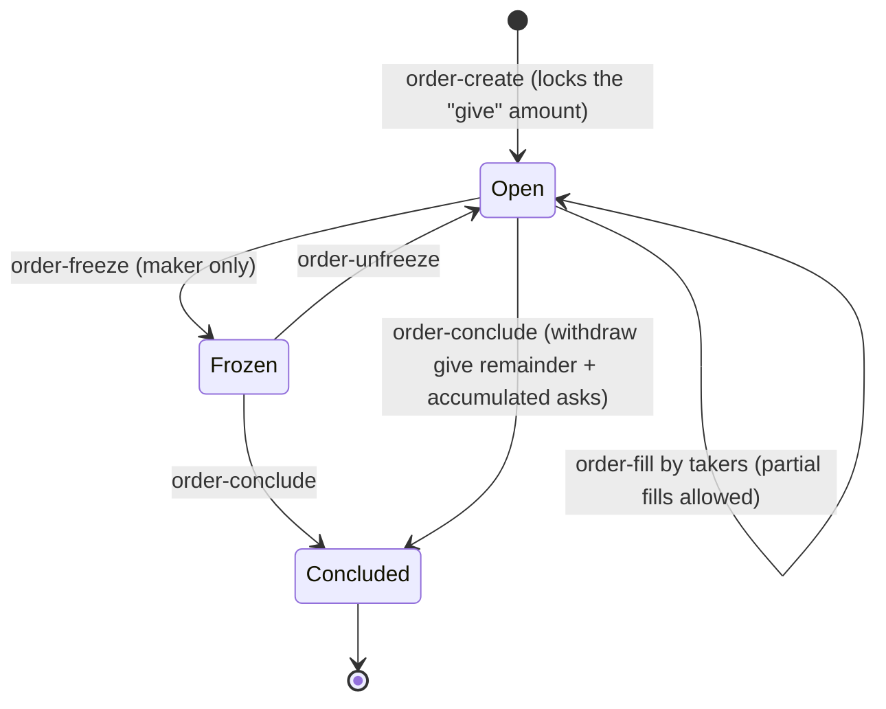

Mintlayer has a native on-chain order book. Orders allow you to offer one currency (coins or tokens) in exchange for another at a fixed rate, without a centralised exchange or counterparty trust.

This guide covers the full flow for both sides of a trade: creating an order (maker) and filling one (taker).

---

## Concepts

**Maker**: Creates an order by locking a "give" amount on-chain. Sets the exchange rate by specifying how much they ask in return.

**Taker**: Fills an existing order by providing the asked currency and receiving the given currency.

**Exchange rate**: Determined by the ratio `give_amount / ask_amount`. For example, if you give 1000 ML and ask for 100 MYTKN, the rate is 10 ML per MYTKN.

**Partial fills**: An order does not need to be filled in one transaction. Takers can fill any portion of the remaining ask amount.

**Conclude key**: The address that can freeze or conclude the order at any time. Only the maker holds this key.

An order moves through the following states:



---

## Part 1: Making an Order (Selling)

### Step 1: Check what orders already exist

Before creating a new order, see what is already on the market:

```
order-list-all-active
```

Filter by currency if needed:

```
# See all orders giving ML coins
order-list-all-active --give-currency coin

# See all orders for a specific token
order-list-all-active --ask-currency <token_id>
```

> **Warning**: Token tickers are not unique. Always verify the token id, not just the ticker.

### Step 2: Create the order

```
order-create <ASK_CURRENCY> <ASK_AMOUNT> <GIVE_CURRENCY> <GIVE_AMOUNT> <CONCLUDE_ADDRESS>
```

The full `give` amount is locked on-chain immediately. The `conclude_address` should be an address you control, it is the only key that can conclude or freeze the order.

**Examples:**

```
# Offer 1000 ML, asking for 100 units of a token (rate: 10 ML per token)
order-create <token_id> 100 coin 1000 <my_address>

# Offer 500 units of a token, asking for 50 ML (rate: 10 ML per token)
order-create coin 50 <token_id> 500 <my_address>
```

Note the order id from the output, you will need it to manage the order later.

### Step 3: Monitor your orders

```
order-list-own
```

This shows all orders where the conclude key belongs to the current account, along with remaining balances.

### Step 4: Conclude the order

When you are done (fully filled, or you want to cancel), conclude the order to withdraw:
- All accumulated asked currency received from fills
- Any remaining given currency that was not filled

```
order-conclude <order_id>

# Or specify where to receive the funds
order-conclude <order_id> <my_address>
```

### Step 4 (alternative): Freeze then conclude

If the order is being actively filled and your conclude transaction conflicts, freeze it first:

```
order-freeze <order_id>
```

Wait for the freeze to be confirmed in a block, then conclude:

```
order-conclude <order_id> <my_address>
```

---

## Part 2: Taking an Order (Buying)

### Step 1: Find an order to fill

```
order-list-all-active
```

The output shows each order's id, give currency, remaining give balance, ask currency, remaining ask balance, and the give/ask ratio.

Example output:
```
Id: mordr1rkj..., Given: ML [left: 1000], Asked: MYTKN [left: 100], Give/Ask: 10
```

This means: for every 1 MYTKN you provide, you receive 10 ML.

### Step 2: Fill the order

Provide the amount of the **asked** currency you want to spend:

```
order-fill <order_id> <ask_amount>

# Or receive to a specific address
order-fill <order_id> <ask_amount> <destination_address>
```

**Example:** Fill the order above partially, buy 50 ML by providing 5 MYTKN:

```
order-fill mordr1rkj... 5
```

You will receive 50 ML (at the 10 ML/MYTKN rate) at a new receive address, or at the address you specify.

---

## Part 3: Full Trade Example

Alice has 1000 ML and wants MYTKN. Bob has MYTKN and wants ML.

**Alice creates the order:**
```
order-create <mytkn_token_id> 100 coin 1000 <alice_address>
```
Alice locks 1000 ML on-chain. The order is now visible to everyone.

**Bob sees the order and fills it:**
```
order-list-all-active --give-currency coin
order-fill <order_id> 100 <bob_address>
```
Bob provides 100 MYTKN and receives 1000 ML at Bob's address.

**Alice concludes the order:**
```
order-conclude <order_id> <alice_address>
```
Alice receives her 100 MYTKN.

---

## Notes

- Fees are paid in ML coins on both sides.
- Partial fills are supported, a taker can fill any portion of the remaining ask amount.
- An order can be filled by multiple takers over time.
- Once concluded, an order is closed permanently. There is no way to reopen it.
- A frozen order can no longer be filled, but can still be concluded by the maker.

---

## Quick Reference

| Task | Command |
|---|---|
| List all active orders | `order-list-all-active` |
| Filter by currency | `order-list-all-active --ask-currency coin` |
| List your own orders | `order-list-own` |
| Create an order | `order-create <ask_currency> <ask_amount> <give_currency> <give_amount> <conclude_address>` |
| Fill an order | `order-fill <order_id> <ask_amount>` |
| Freeze an order | `order-freeze <order_id>` |
| Conclude an order | `order-conclude <order_id>` |

---

## Related Pages

- [`order-create`](../wallet/cli/commands/orders/order-create-command-guide.md)
- [`order-fill`](../wallet/cli/commands/orders/order-fill-command-guide.md)
- [`order-freeze`](../wallet/cli/commands/orders/order-freeze-command-guide.md)
- [`order-conclude`](../wallet/cli/commands/orders/order-conclude-command-guide.md)
- [`order-list-own`](../wallet/cli/commands/orders/order-list-own-command-guide.md)
- [`order-list-all-active`](../wallet/cli/commands/orders/order-list-all-active-command-guide.md)
