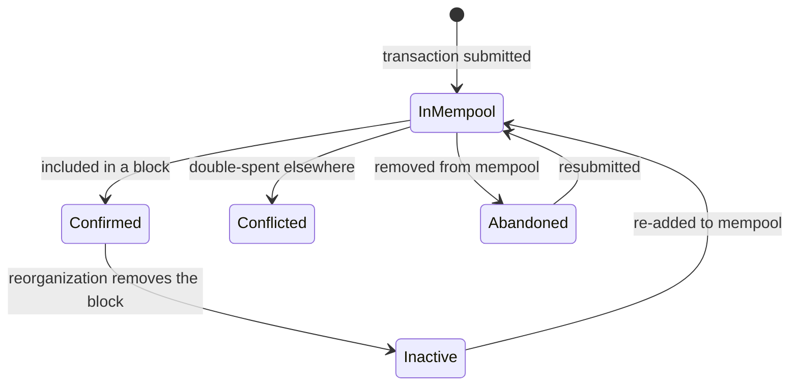

The wallet RPC supports real-time event notifications over **WebSocket**. HTTP does not support subscriptions.

Events follow the [Ethereum pubsub spec](https://geth.ethereum.org/docs/interacting-with-geth/rpc/pubsub) format.

---

## Subscribing

Send the `subscribe_wallet_events` method over WebSocket. You will receive a subscription confirmation, then events as they occur.

```js
import { WebSocket } from 'ws'; // npm install ws

const ws = new WebSocket('ws://127.0.0.1:3034');

ws.on('open', () => {
  ws.send(JSON.stringify({
    jsonrpc: '2.0',
    id: 1,
    method: 'subscribe_wallet_events',
    params: [{}],
  }));
});

ws.on('message', (data) => {
  const msg = JSON.parse(data);

  // Subscription confirmation
  if (msg.id === 1) {
    console.log('Subscribed, subscription id:', msg.result);
    return;
  }

  // Event notification
  if (msg.method === 'wallet_subscription_event') {
    const event = msg.params.result;
    console.log('Event:', JSON.stringify(event, null, 2));
  }
});
```

## Unsubscribing

Pass the subscription id returned from the subscribe call to `unsubscribe_wallet_events`:

```js
ws.send(JSON.stringify({
  jsonrpc: '2.0',
  id: 2,
  method: 'unsubscribe_wallet_events',
  params: [subscriptionId],
}));
```

---

## Event Types

### `NewBlock`

Fired when a new block is connected to the best chain.

```json
{ "NewBlock": {} }
```

```js
if ('NewBlock' in event) {
  console.log('New block arrived');
}
```

### `TxUpdated`

Fired when a transaction's state changes (including new incoming transactions).

```json
{
  "TxUpdated": {
    "account_id": "<account_id_hex>",
    "tx_id": "<tx_id_hex>",
    "state": "<transaction_state>"
  }
}
```

Transaction states: `Confirmed`, `InMempool`, `Conflicted`, `Abandoned`, `Inactive`.



```js
if ('TxUpdated' in event) {
  const { account_id, tx_id, state } = event.TxUpdated;
  console.log(`Tx ${tx_id} is now ${state}`);
}
```

### `TxDropped`

Fired when the wallet stops tracking a transaction.

```json
{
  "TxDropped": {
    "account_id": "<account_id_hex>",
    "tx_id": "<tx_id_hex>"
  }
}
```

```js
if ('TxDropped' in event) {
  console.log('Transaction dropped:', event.TxDropped.tx_id);
}
```

### `RewardAdded`

Fired when the wallet receives a block reward (staking).

```json
{
  "RewardAdded": {
    "account_id": "<account_id_hex>",
    "block_id": "<block_id_hex>",
    "height": 12345,
    "timestamp": { "timestamp": 1700000000 },
    "utxos": [...]
  }
}
```

```js
if ('RewardAdded' in event) {
  const { block_id, height } = event.RewardAdded;
  console.log(`Block reward received at height ${height}, block ${block_id}`);
}
```

### `RewardDropped`

Fired when a block reward is no longer valid (e.g. reorg).

```json
{
  "RewardDropped": {
    "account_id": "<account_id_hex>",
    "block_id": "<block_id_hex>"
  }
}
```

---

## Full Example: Wallet Monitor

```js
import { WebSocket } from 'ws';

function monitorWallet({ host = '127.0.0.1', port = 3034 } = {}) {
  const ws = new WebSocket(`ws://${host}:${port}`);
  let subscriptionId = null;

  ws.on('open', () => {
    console.log('Connected to wallet RPC');
    ws.send(JSON.stringify({
      jsonrpc: '2.0',
      id: 1,
      method: 'subscribe_wallet_events',
      params: [{}],
    }));
  });

  ws.on('message', (data) => {
    const msg = JSON.parse(data);

    if (msg.id === 1 && msg.result !== undefined) {
      subscriptionId = msg.result;
      console.log('Subscribed, id:', subscriptionId);
      return;
    }

    if (msg.method !== 'wallet_subscription_event') return;
    const event = msg.params.result;

    if ('NewBlock' in event) {
      console.log('[Block] New block connected');
    } else if ('TxUpdated' in event) {
      const { tx_id, state } = event.TxUpdated;
      console.log(`[Tx] ${tx_id} → ${state}`);
    } else if ('TxDropped' in event) {
      console.log(`[Tx] Dropped: ${event.TxDropped.tx_id}`);
    } else if ('RewardAdded' in event) {
      const { height, block_id } = event.RewardAdded;
      console.log(`[Reward] Block reward at height ${height} (${block_id})`);
    } else if ('RewardDropped' in event) {
      console.log(`[Reward] Dropped: ${event.RewardDropped.block_id}`);
    }
  });

  ws.on('close', () => console.log('Disconnected'));
  ws.on('error', (err) => console.error('WebSocket error:', err));

  return ws;
}

monitorWallet();
```

---

## Related Pages

- [Wallet RPC: Overview](overview.md)
- [Wallet RPC: Wallet Management](wallet-management.md)
- [Wallet RPC: Transactions](transactions.md)
